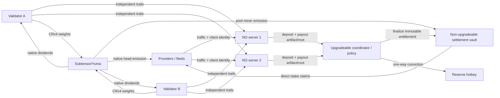

# UR Subnet release 1.0 finalization plan

**Status:** release-1.0 implementation and continuous adversarial campaign complete locally; testnet inputs, alpha bootstrap and isolated dependency preflight complete; full `sim-testnet` launch is fail-closed while the private Subtensor archive catches up, 2026-08-21 UTC
**Normative product specification:** `WHITEPAPER.md` v1.0 and the non-parked parts of `VALIDATOR.md`
**Target:** `sim-testnet` reproducibly validates and configures the supplied existing Bittensor testnet subnet, deploys the release contracts, and leaves a value-capped, fully working topology running—operator(s), miners, validators, traffic, settlement, and claims—followed by a multi-epoch validation campaign and an evidence-backed release 1.0 go/no-go decision

This document is both the original audit plan and its completion record. The F0-F6
engineering work is implemented in this checkout. M0A-M3 and MR remain execution proof
gates, not missing code. The `testnet-` values are filled and netuid 521 is activated
with sufficient alpha. M0A still requires the shared private Subtensor node to reach
the runtime-447 finalized tip; M0B-M3 and MR require a green read-only `doctor` and an
exact spend-bounded plan hash. The user has granted standing authorization in
this testnet session to generate, verify, and apply that exact plan once the
doctor is green; this does not authorize any mainnet write. The full local integration topology has not been
launched; only the separately approved, bounded activation/alpha bootstrap was
written to testnet.

**Version terminology:** Whitepaper 1.0 is the normative specification and release 1.0 is the software/protocol release that implements it. “v1” inside the whitepaper is shorthand for this same 1.0 release. The former Whitepaper v0.5 design has been promoted to 1.0 without adding the explicitly parked validator-effort bounty.

## 1. Executive verdict

The release-1.0 implementation runs its **read-only testnet preflight** against the
reachable private RPC and fails closed until that archive is current. It is not yet
a testnet-validated release: Docker is installed and both isolated operator PostgreSQL/Redis pairs pass
authenticated live readiness checks, but the full M0A topology and live M0B-M3/MR campaign have not
run. Wallet control, netuid 521, balances, runtime call shapes, subnet activation
and sufficient campaign alpha have been independently verified. The remaining
distinction is fail-closed in code; no default or unprefixed mainnet value can
silently authorize a testnet write.

All 17 blockers found by the initial audit are addressed:

| Initial blocker | Implemented release-1.0 resolution |
|---|---|
| Global validator quality | Versioned operator registry, isolated per-NO samples/statistics and exact `implied_usage × Q` vectors. |
| One-client head binding | Canonical multi-client fleet manifests, Ed25519 client signatures, sr25519 hotkey signatures, finalized native commitments and live UID checks. |
| EVM-mirror binding authorization | Runtime-447 sr25519 verifier plus commitment-oracle mirroring; normal Substrate hotkeys authorize fleets without owning an H160 mirror. |
| Cross-NO deposit theft | Atomic signer/nonce/policy-bound deposit and conviction calls; exact received-funds accounting and adversarial tests. |
| Late-roll emission attribution | One boundary capture per pool/epoch with explicit defer/carry transitions and conservation invariants. |
| Upgradeable custody | Non-upgradeable `STReserveSink` and `STSettlementVault`; only the coordination layer is UUPS. Finalized claims remain outside upgrade/pause/admin reach. |
| Missing TTL/remainder policy | Immutable expiry, grace, missed-root, carry, partial-claim, retry and exact-rao conservation rules. |
| Network-level payout attribution | Provider/client/epoch-accurate event index and payout artifacts with deterministic epoch-boundary fleet exclusion. |
| Single-operator validator | Multi-NO authenticated endpoints, per-NO trail stores, finality-bound inputs, independent intent journal and per-NO quality output. |
| Unsafe event ingestion | Block-hash checkpoints, confirmation/finality gates, rewind/replay, explicit deployment origin and durable transaction intent/recovery. |
| Unexercised CRv4 lifecycle | Exact rational normalization, policy/hash gates, commit/reveal/finality intent states, restart recovery and live-campaign assertions. Funded live proof remains M0B. |
| Obsolete Subtensor image | `xops` pins runtime v447 by immutable digest, archive retention and the required safe RPC gateway methods, with Ansible regression tests. |
| Zero/disabled testnet config | Strict `testnet-` launch schema and materializer. Wallet/password references, netuid, local origins and three spend ceilings are populated; generated deployment values are written to an isolated runtime profile. |
| Missing verify key | Harness-derived, versioned per-operator verify keys with rotation/overlap and signed evidence; no secret enters the public manifest. |
| Distinguishable poisoning | Full-depth routable shadow/padding paths with uniform response surface and constant-envelope failure handling, covered by operator tests. |
| No reproducible environment | Portable Go harness manages pinned PostgreSQL/Redis, builds locked binaries and supervises two NOs, eight miners, two validators, claim daemons and two independently keyed three-client head fleets. Existing `server/blob` MinIO is reused. |
| Empty `sim-testnet` | Complete `doctor`, `plan`, `setup`, `launch`, `resume`, `status`, `inspect`, `analyze`, `scenario`, `tail`, `stop` and future-effective `retire` commands with an append-only transaction journal. |

### 1.1 Completion by workstream

| Gate | State | Principal evidence |
|---|---|---|
| F0 specification | Implemented | Whitepaper v1.0, `docs/spec/`, canonical Go/Solidity encodings and golden-vector tests. |
| F1 infrastructure | Implemented locally | v447 digest/archive/RPC Ansible configuration, capability doctor and regression tests. The live gateway is reachable; finalized catch-up/canonical-head proof remains M0B. |
| F2 contracts | Implemented and locally verified | Split reserve/vault/coordinator deployment, generated ABIs/bytecode, and a passing Foundry suite including fuzz and stateful invariants. |
| F3 operator | Implemented and locally verified | Finality-safe index, exact artifacts, public history, multi-NO verification, key rotation, poisoning and proxy attribution/release cleanup. DB-backed launch proof is M1. |
| F4 validator | Implemented and locally verified | Multi-NO sampling, failure attribution, exact CRv4, EMA head scoring, masks and durable finalized intent lifecycle. |
| F5 miner | Implemented and locally verified | Fleet binding/commitment lifecycle, payout verification, finality-safe claims and persistent claim daemon. |
| F6 harness/operations | Implemented and locally verified | Source/artifact lock, bounded plans, wallet proof, setup convergence, persistent supervision, evidence publication, fault scenarios, production soak and retirement. |
| M0A-M3/MR | Fail-closed at private-node catch-up | Both locked per-operator PostgreSQL/Redis pairs pass authenticated settings/readiness probes. The overlay Subtensor peer is reachable, physically independent and actively syncing; the 2026-08-21 13:32 UTC read-only snapshot observed 20 peers, private sync-state block 2,895,368/runtime 196, and advertised public head 7,831,409/runtime 447. Initial archive sync can take days; no fixed completion time is assumed. The full campaign requires peers, `isSyncing=false`, at most three finalized blocks of lag, canonical checkpoint agreement, green `doctor`, and the exact regenerated plan hash; vault inputs, alpha, and standing testnet authorization are ready. |

The original audit and acceptance plan follows. Statements in its “initial/current
state” columns record the pre-implementation baseline; the completion tables above
and the final verification appendix are authoritative for this checkout.

## 2. Initial audit evidence (historical baseline)

### 2.1 Repository snapshot

The audit used clean worktrees at:

| Repository | Commit |
|---|---|
| `sn` | `4d6944d6c60a3170da502572f2bbc7973e160de8` |
| `server` | `2480ae0dc6c45ce02254fd9399cb10037ab99fbe` |
| `xops/main` | `06a79c82ebe7d1a3c532c9915c0492fdc8ab4e73` |
| Subtensor source checked for live compatibility | tag `v447`, commit `1f090af85d1771c5d8ece1f0910576fbd129906e` |

The audit covered `WHITEPAPER.md`, `VALIDATOR.md`, all Go packages in `sn`, the Solidity source/tests/scripts, the miner and validator CLIs, the server ST and `/verify` paths, current vault shapes without exposing secrets, the empty `sim-testnet/` directory, and the Subtensor Ansible deployment.

### 2.2 Tool and test baseline

Foundry was missing at the start of the audit. It is now installed through the official installer at `/home/by/.foundry/bin`:

| Tool | Installed version |
|---|---|
| `forge`, `cast`, `anvil`, `chisel` | Foundry `v1.7.1` (`4072e487...`) |
| Solidity compiler target | `0.8.24`, Cancun, as configured by the repository |
| OpenZeppelin contracts | repository-documented tag `v5.6.1` in ignored `evm/lib` |
| OpenZeppelin upgradeable | repository-documented tag `v5.6.1` in ignored `evm/lib` |
| forge-std | repository-documented tag `v1.16.2` in ignored `evm/lib` |

Observed results at the start of the audit (superseded by Appendix A's final
verification record):

| Command | Result | Interpretation |
|---|---|---|
| `go test ./...` in `sn` | pass | The initial Go packages compiled and passed. |
| `forge test --summary` in `sn/evm` | **75 passed, 0 failed** | Initial monolithic-contract baseline; the release split's final result is recorded in Appendix A. |
| `forge fmt --check` | fail | Initial formatting defect; the completed release passes `forge fmt --check`. |
| `go test ./st` in `server` | pass | Endpoint/config resolution unit tests pass. |
| `go test ./st ./controller ./model` in `server`, 10-minute timeout | fail/timeout | `st` passed; broad controller/model tests require `WARP_ENV` and PostgreSQL resources not present in this shell. `TestRemoveNetwork` remained blocked in the retrying environment setup. |
| `bash -n ansible/run-subtensor.sh` | pass | Wrapper syntax only; it does not validate the playbook or deployed host. |

Two green legacy-monolith tests were direct evidence of the launch defects. They are
retained only as a regression description for the non-release `STSubnet`; release
deployment exclusively uses the split contracts, whose `Release*` suites prove the
opposite invariants:

- `test_deposit_unattributedPush_attributableByOtherAuthorizedNO`
- `test_rollEpochs_multiRoll_attributesToFirstUnrolledEpoch`

The governance tests named `ownerCannotClawBack...` and `upgradeUnderFire...` demonstrate behavior only under the supplied benign upgrade. They do not establish the invariant against an arbitrary proxy-admin implementation.

### 2.3 Live testnet evidence

Read-only probes on 2026-08-20 established this baseline:

| Property | Observed value |
|---|---|
| Substrate endpoint used for public probes | `wss://test.finney.opentensor.ai:443` / HTTPS JSON-RPC equivalent |
| EVM endpoint used for public probes | `https://test.chain.opentensor.ai` |
| `system_chain` | `Bittensor` |
| `specName` / `specVersion` | `node-subtensor` / **447** |
| transaction/state version | `1` / `1` |
| genesis hash | `0x8f9cf856bf558a14440e75569c9e58594757048d7b3a84b5d25f6bd978263105` |
| SS58 format | `42` |
| native symbol/decimals | `testTAO` / `9` |
| EVM chain ID | **945** (`0x3b1`) |
| expected block cadence for this deployment | 12 seconds |
| current CR weight version | 4 |

Read-only calls against runtime 447 succeeded for:

- the Ed25519 known-answer vector at precompile `0x402`;
- metagraph `getUidCount`, `getHotkey`, and `getColdkey` at `0x802`;
- Neuron `getUid(netuid, hotkey)` at `0x804`; and
- Staking V2 `getTotalHotkeyStake` at `0x805`.

The live CRv4 suite also passed:

```text
SP2_LIVE=1 SP2_SUBSTRATE=wss://test.finney.opentensor.ai:443 SP2_NETUID=1 \
  go test ./crv4 -run TestLive -v -count=1

runtime spec=447 tx=1
commit_timelocked_weights call index=113
commit_timelocked_mechanism_weights call index=118
CommitRevealWeightsVersion=4
signed dry-run extrinsic=416 bytes (not submitted)
```

This proves current metadata decoding and construction, not funded submission or reveal. The public EVM service rejected `eth_getLogs` as a disallowed method; it cannot be the event-indexing fallback.

The authoritative upstream references for the runtime/operations work are the [RaoFoundation Subtensor v447 source](https://github.com/RaoFoundation/subtensor/tree/v447), its [node operation guide](https://github.com/RaoFoundation/subtensor/blob/v447/docs/guides/running-a-node.mdx), and its [EVM guide](https://github.com/RaoFoundation/subtensor/blob/v447/docs/guides/evm/index.mdx). The node guide states that public endpoints are rate limited, lite nodes retain only recent state, and historical/indexer workloads need archive access.

### 2.4 Bittensor adversarial research and executable coverage

The release threat catalogue is the checked-in, canonically hashed
[`docs/spec/adversarial-matrix-v1.json`](docs/spec/adversarial-matrix-v1.json).
It has 54 mandatory rows: 12 live-safe exercises, 27 bounded emulations, nine
local-runtime-only attacks with continuous live sentinels, and six
observation-only risks. A matrix row is incomplete unless it names sources,
preconditions, execution mode, concurrent actors, oracle, metrics, stop
conditions, and checked-in tests. The loader rejects missing rows, unknown
actors, missing tests, unsafe modes, any omission of a published advisory, an
unreviewed/mismapped issue source, or a row for which no mapped actor can emit a
declared metric. Runtime evidence is stricter: every passing vector must contain
at least one actually sampled metric named by that vector.

The final upstream delta review on 2026-08-21 paginated the complete public
RaoFoundation `bittensor` and `subtensor` issue histories, not only open issues
or label-filtered search results. The matrix now cites 113 distinct sources,
including all eight published Subtensor advisories, 63 concrete Subtensor issue
reports, and every security-relevant issue in the current Bittensor SDK history;
the latter repository has no issue newer than #3407. Removed issue #3092 contains
no public failure description and therefore cannot support a test oracle. New
upstream issues after this snapshot must be reviewed and either mapped or
explicitly rejected with rationale before regenerating the release lock.

The primary-source review produced these attack families:

| Family | Upstream evidence | Release exercise |
|---|---|---|
| Minority cabal, selfish weight, rival knifing, threshold crossing and zero-utility behavior | [Yuma Consensus](https://www.bittensor.com/docs/internals/consensus) and [stake-based consensus research](https://www.bittensor.com/content/consensus_v2) | Continuous stake sweeps below and at kappa; honest-vector preservation, cabal clipping and the exact protection boundary are asserted. |
| Stale copying, reveal following and free riding | [weight-copying paper](https://docs.bittensor.com/papers/BT-Consensus-based-Weights.pdf) and [CCS poster](https://docs.bittensor.com/papers/ACM_CCS2024_Poster.pdf) | A delayed copier, stale-vector swap and reveal follower run alongside honest validators; commit/reveal lifecycle and finalized ordering are separately checked. |
| YC3/liquid-alpha bond timing and participation churn | [runtime bond equations](https://www.bittensor.com/docs/internals/consensus), [bond EMA parameters](https://www.bittensor.com/docs/hyperparameters/bonds-moving-avg), [validator permit behavior](https://www.bittensor.com/docs/hyperparameters/max-validators), and the [v446 consensus-mode change](https://www.bittensor.com/releases/v446-upgrade) | The actor sweeps current/previous consensus and sigmoid steepness. An early independent evaluator must retain more than its 60% stake share, a delayed copier less than its 40% share, and permit loss must clear accumulated bonds. |
| Validator/UID/hotkey churn, Sybil fleets and affiliation masking | Runtime identity/pruning semantics plus the protocol fleet model | Generation, commitment, signature, effective-epoch, live-UID and shared-prefix mutations run continuously; stale or affiliated identities must remain excluded. |
| Economic and availability pressure | Registration limits, moving-price pruning, reserve-flow accounting, root-basket exits, proxy-stake transaction ordering, RPC/archive behavior and operator dependencies | Common-finalized private/public reads retain UID count, spot/moving alpha price, TAO/alpha reserve minima, lag and hashes while bounded API/RPC pressure, proportional root-exit and sandwich/slippage models, and scheduled process faults run. |
| UR protocol attacks | Whitepaper/validator threat model and implementation audit | Real concurrent EXTEND/replay, poison distinguishability, vpk rotation, malformed signatures, artifact tamper/equivocation, domain/nonce/expiry replay, rounding/overflow, malicious upgrade, late keeper, carry/claim and dependency-loss actors overlap every happy path. |

The [RaoFoundation advisory index](https://github.com/RaoFoundation/subtensor/security/advisories)
currently publishes eight advisories. All eight are explicit matrix inputs:

| Advisory | Vector and disposition |
|---|---|
| [GHSA-h98r-p37h-h4mv](https://github.com/RaoFoundation/subtensor/security/advisories/GHSA-h98r-p37h-h4mv) | Fee-free weight block fill; reproduce only on the pinned local runtime, monitor live inclusion/RPC latency. |
| [GHSA-m759-m8mv-q3m5](https://github.com/RaoFoundation/subtensor/security/advisories/GHSA-m759-m8mv-q3m5), [GHSA-qh57-vpv2-3fvp](https://github.com/RaoFoundation/subtensor/security/advisories/GHSA-qh57-vpv2-3fvp), [GHSA-xm63-2wwx-pm6w](https://github.com/RaoFoundation/subtensor/security/advisories/GHSA-xm63-2wwx-pm6w) | Restricted-proxy coldkey/identity/owner alias bypasses; exact local-runtime authorization tests plus live identity/runtime sentinels. No testnet actor touches a third-party proxy. |
| [GHSA-vpjj-mhgr-cphg](https://github.com/RaoFoundation/subtensor/security/advisories/GHSA-vpjj-mhgr-cphg), [GHSA-wc2g-rc74-vgw3](https://github.com/RaoFoundation/subtensor/security/advisories/GHSA-wc2g-rc74-vgw3) | Hotkey cooldown and ChildkeyTake migration; local-runtime reproduction plus continuous generation/binding checks. |
| [GHSA-rhmm-mqf8-v6gv](https://github.com/RaoFoundation/subtensor/security/advisories/GHSA-rhmm-mqf8-v6gv) | Root coldkey-index bloat; v447 dense swap-remove/bijection model and runtime pin. |
| [GHSA-6c95-q3r3-rgwq](https://github.com/RaoFoundation/subtensor/security/advisories/GHSA-6c95-q3r3-rgwq) | RootClaimed hotkey-swap watermark inflation; all root-destination cleanliness fields and future owed amount are modeled. |

The archived Python SDK/transport repository has separate, recent
security-relevant reports. They are release-locked inputs rather than being
mistaken for Subtensor-runtime advisories:

| Bittensor issue | Vector and release exercise |
|---|---|
| [Missing signature accepted by `default_verify` #3392](https://github.com/RaoFoundation/bittensor/issues/3392) | The operator rejects absent and invalid SEED signatures before any trail/DB state exists. The live verify actor alternates both shapes and requires zero unauthorized trails. |
| [Finalized-head anchored 8-block MEV era #3395](https://github.com/RaoFoundation/bittensor/issues/3395) | The RPC actor continuously records best/finalized lag and whether it consumes an eight-block SDK window. UR's CRv4 signer is regression-tested to use its nonce-protected immortal extrinsic rather than inheriting this SDK wrapper failure. |
| [Plaintext unauthenticated Dendrite transport #3406](https://github.com/RaoFoundation/bittensor/issues/3406) | Release miners reject non-loopback `http://`/`ws://` operator origins, including one-shot flag overrides. Real loopback FINALs are signed and every canonical/signature mutation must fail. |
| [Constant empty-field Synapse body hash #3407](https://github.com/RaoFoundation/bittensor/issues/3407) | Every field of a real valid FINAL is mutated independently; canonical validation plus validator/server signatures reject all mutations and the accepted constant-hash count remains zero. |

Runtime v447 postdates the advisories' patched mainnet spec 419, but version
ordering alone is not accepted as proof: source commit
`1f090af85d1771c5d8ece1f0910576fbd129906e`, runtime spec, metadata, precompile
behavior and local regression tests are release-locked together.

Relevant open upstream issues were also reviewed, rather than silently treating
an advisory-only search as exhaustive:

| Open issue | Release/mainnet disposition |
|---|---|
| [Precompile versioning #2455](https://github.com/RaoFoundation/subtensor/issues/2455) | Continuous code/selector/read-battery and runtime drift gate; any change puts writers in safe-read-only mode. |
| [Depressed-reserve flow #2737](https://github.com/RaoFoundation/subtensor/issues/2737) and [partial coinbase swap accounting #2740](https://github.com/RaoFoundation/subtensor/issues/2740) | Live reserve/price minima plus a signed-flow model run continuously. Mainnet is no-go until the pinned runtime fixes these paths or an exact-runtime proof establishes that the deployed mechanism cannot reach them. |
| [Invisible root-basket entitlement after unstake #3008](https://github.com/RaoFoundation/subtensor/issues/3008) | A continuous exact proportional-claim/remainder model now covers partial and complete exits, including uint64 boundaries. The release does not root-stake, and MR must independently prove every release coldkey has zero hidden root-basket entitlement; any future root path must atomically inventory and claim it. |
| [Subnet eviction/first refusal #3024](https://github.com/RaoFoundation/subtensor/issues/3024) | Continuous UID and moving/spot-price sentinel. Mainnet requires a nonzero moving price, immunity/pruning-rank review and an alert/runbook before value launch. |
| [Metagraph commitment field type confusion #3064](https://github.com/RaoFoundation/subtensor/issues/3064) | Continuous full-registration parser mutations cover `ResetBondsFlag`, multi-field values ending in SHA-256, truncation, trailing bytes and zero hashes. The release accepts only the exact pinned runtime-447 one-field SHA-256 encoding and never relies on a generic metagraph shape. |
| [Proxy staking without MEV shield #3066](https://github.com/RaoFoundation/subtensor/issues/3066) | A constant-product same-direction front-run model continuously records victim loss and proves a minimum-output bound rejects the hostile ordering. Testnet and mainnet release flows refuse unshielded proxy staking; direct 2-of-3 governance does not waive execution-price limits on any value-bearing swap. |

Closed issues are regression evidence, not erased from the threat model. The
second source-history pass added ten continuous model/sentinel rows:

| Historical failure family | Primary issues | Concurrent release oracle |
|---|---|---|
| Non-atomic composite calls and false success | [failed precompile refund #2156](https://github.com/RaoFoundation/subtensor/issues/2156), [orphaned injection #2661](https://github.com/RaoFoundation/subtensor/issues/2661), [claim paid without transfer #2662](https://github.com/RaoFoundation/subtensor/issues/2662), [partial alpha-fee withdrawal #2664](https://github.com/RaoFoundation/subtensor/issues/2664), [non-atomic recycle/burn #2666](https://github.com/RaoFoundation/subtensor/issues/2666), [price-limit stranded TAO #2735](https://github.com/RaoFoundation/subtensor/issues/2735) | Copy-on-write forced-failure cases require byte-exact rollback, no paid watermark/event, no stranded input and a retryable pending value. |
| Identity, lock and reward migration loss | [child assignments #2146](https://github.com/RaoFoundation/subtensor/issues/2146), [root dividends #2515](https://github.com/RaoFoundation/subtensor/issues/2515), [aggregate lock over-reduction #2665](https://github.com/RaoFoundation/subtensor/issues/2665), [conviction #2726](https://github.com/RaoFoundation/subtensor/issues/2726), [perpetual-lock downgrade #2739](https://github.com/RaoFoundation/subtensor/issues/2739) | Every security field migrates bijectively; contributor lock mass equals the aggregate, perpetual state remains perpetual, and the old identity is empty. |
| Order, issuance, reserve and emission drift | [issuance/burn #2274](https://github.com/RaoFoundation/subtensor/issues/2274), [zero-share order charge #2792](https://github.com/RaoFoundation/subtensor/issues/2792), [reserve migration shrink #2793](https://github.com/RaoFoundation/subtensor/issues/2793), [partial-fill double debit #2795](https://github.com/RaoFoundation/subtensor/issues/2795), [dust issuance #2738](https://github.com/RaoFoundation/subtensor/issues/2738), [flow toggle spike #2667](https://github.com/RaoFoundation/subtensor/issues/2667) | Zero/over-fill rejects are state-neutral, replay is idempotent, account sums equal issuance after explicit dust burn, migration includes every reserve component, and pending emissions are never dropped or injected as stale one-block flow. |
| Runtime/RPC resource exhaustion and panic | [failed-call load #2394](https://github.com/RaoFoundation/subtensor/issues/2394), [transaction-pool panic #2405](https://github.com/RaoFoundation/subtensor/issues/2405), [unbounded root iteration #2411](https://github.com/RaoFoundation/subtensor/issues/2411), [archive-node memory growth #2724](https://github.com/RaoFoundation/subtensor/issues/2724), [unmetered Alpha views #2741](https://github.com/RaoFoundation/subtensor/issues/2741) | Collection/work bounds reject before mutation; capped live RPC/API actors measure finality and latency. Chain-wide load reproduction is M0A-only. |
| Randomness, registration and liquidity liveness | [concentrated-liquidity freeze #2228](https://github.com/RaoFoundation/subtensor/issues/2228), [drand watermark jump #2794](https://github.com/RaoFoundation/subtensor/issues/2794), [initial owner floor price #2844](https://github.com/RaoFoundation/subtensor/issues/2844), [unequal lock under-backing #3026](https://github.com/RaoFoundation/subtensor/issues/3026) | Far-future randomness rounds are state-neutral rejects; queued registration escrow backs the sum, unpriced owner allocation is zero, failed swaps are atomic/retryable, and live prices/reserves stay above reviewed minima. |
| Graph/lifecycle cleanup | [child self-loop #2109](https://github.com/RaoFoundation/subtensor/issues/2109), [empty child set #2110](https://github.com/RaoFoundation/subtensor/issues/2110), [zero-row state bloat #2398](https://github.com/RaoFoundation/subtensor/issues/2398), [weights/bonds cleanup #2399](https://github.com/RaoFoundation/subtensor/issues/2399), [lease-derived stranded stake #2663](https://github.com/RaoFoundation/subtensor/issues/2663) | Empty/self/indirect-cycle graph changes reject, dense indexes remain bijective, and lease termination repatriates alpha/locks and clears every derived-coldkey row before removing authority. |

The issue-history audit also binds earlier operational regressions to those same
oracles: broken rate-limit state ([#2102](https://github.com/RaoFoundation/subtensor/issues/2102)); registration-burn observability/price drift ([#2104](https://github.com/RaoFoundation/subtensor/issues/2104), [#2291](https://github.com/RaoFoundation/subtensor/issues/2291)); stale service/subnet identity ([#2200](https://github.com/RaoFoundation/subtensor/issues/2200), [#2572](https://github.com/RaoFoundation/subtensor/issues/2572)); missing staking indexes ([#2201](https://github.com/RaoFoundation/subtensor/issues/2201)); mechanism-emission and keep-claim errors ([#2194](https://github.com/RaoFoundation/subtensor/issues/2194), [#2195](https://github.com/RaoFoundation/subtensor/issues/2195)); shared-pool precision ([#2336](https://github.com/RaoFoundation/subtensor/issues/2336)); and frozen/lagging RPC nodes plus finalized-head access ([#2553](https://github.com/RaoFoundation/subtensor/issues/2553), [#2639](https://github.com/RaoFoundation/subtensor/issues/2639), [#3068](https://github.com/RaoFoundation/subtensor/issues/3068)). These do not create duplicate rows; their primary URLs are mapped to the exact existing vector and enforced by the matrix loader.

Safety is part of the implementation. Shared-testnet actors use only our
loopback operator APIs, our identities/netuid and capped read RPC. Chain-wide
flooding, proxy takeover, cooldown bypass and global state-bloat reproduction are
confined to the pinned local runtime. All seven actors start before the happy
path and stop only after final reconciliation. Each needs at least 100
non-skipped samples spanning control and attack phases, zero unexpected errors,
and p99 latency at or below 15 seconds. Expected 400/409/429 responses are
classified separately. `adversaries.json` retains actor lifecycle, request and
in-flight counts, latency distributions, each vector's required and actually
measured metric names, per-vector status, and full-campaign min/max/last numeric
sentinels. An anomaly is a release failure and root-cause
work item, never accepted as background adversarial noise.

## 3. Normative interpretation of the whitepaper

Before implementation resumes, merge a small specification PR that makes Whitepaper 1.0 internally consistent. Otherwise different components will continue implementing different versions of the mechanism.

### 3.1 Precedence

Use this precedence order:

1. The v1.0 and v0.4 override notices at the top of `WHITEPAPER.md`.
2. The latest explicit design decisions D25-D29.
3. The detailed non-parked mechanism sections.
4. `VALIDATOR.md` for wire encodings and measurement behavior.
5. `FINALIZE.md` for engineering sequencing and acceptance evidence.
6. Older `PLAN.md`, `IMPLEMENTATION_STATUS.md`, `README.md`, and `docs/LAUNCH.md` only where they do not conflict.

The validator effort bounty is **not a v1 deliverable or roadmap item**. Do not reintroduce `registerValidator`, `submitTrails`, `claimValidator`, fee-pool, effort-root, or effort-digest economics. Preserve its parked references only as history.

`VALIDATOR.md` section 10 labels proof-of-honest-routing, destination diversity, stronger validator-Sybil resistance, and related payout-grade hardening as post-v1 work. These must be listed as explicit residual risks and designed-for seams, but are not silently promoted into the v1 contract. The v1 `/verify` protocol still has to implement every behavior it claims today, including indistinguishable poisoning, correct failure attribution, key rotation, and public proof/stat availability.

### 3.2 Specification corrections required in the first PR

| Inconsistency | Normative release 1.0 resolution |
|---|---|
| Older passages say pool weight is `deposit × quality`. | Everywhere use `implied_usage × quality`, where `implied_usage = epoch deposit / rate(conviction tier)`. |
| Section 6 calls the contract a “deposit ledger,” while D25 removes the ledger. | The contract exposes immutable deposit/conviction events and cumulative reserve audit state; validators maintain a finalized, reorg-safe event index. |
| Some component lists still mention validator registration/effort functions. | Delete them from active interfaces and tests; leave only parked documentation. |
| Early text describes top miners by quality. | Head score is split-adjusted distinct routable egress-prefix breadth, EMA-smoothed. |
| `client_id` sometimes means a UUID and sometimes a 32-byte Ed25519 key. | Define both: `client_id` is the 16-byte UR identity; `client_key` is its 32-byte Ed25519 public key. Bind a versioned tuple containing both. |
| Binding encodings omit chain, netuid, contract, epochs, expiry, generation, and replay protection. | Adopt the canonical manifest in F2.4 of this plan and publish test vectors for client Ed25519 and hotkey sr25519 signatures. |
| FINAL encoding/signature code still signs an effort-derived digest. | v1 signs the canonical FINAL message only. Coverage remains measured metadata; no bounty-domain digest appears in the active protocol. |
| Egress hash encoding and scope differ between documents/components. | Adopt one versioned subnet policy: address family + masked prefix bytes + subnet-wide keyed-hash identifier + domain. All validators and NOs must use the same protected key and produce identical hashes for a prefix during the same policy interval. |
| Operator payout code says an under-allocation remainder “rolls over,” but the contract has no expiry/rollover. | Specify claim TTL, grace, rounding, under-allocation, missed-root, and rollover transitions exactly; implement them in the immutable settlement core. |
| An NO can pre-stake conviction in prose, but only `deposit` exists. | Add a distinct voluntary `addConviction` path/event. It affects cumulative conviction/tier but never current epoch implied usage. |
| Parameter changes are described as not touching in-flight epochs, but the contract changes live epoch values. | Every policy is scheduled with an `effectiveEpoch`; immutable snapshots are readable by epoch. |
| “Finalized claims survive any upgrade” conflicts with a monolithic UUPS owner. | Use a non-upgradeable settlement vault, or weaken the whitepaper. This plan chooses the non-upgradeable settlement vault. |

Deliver a normative requirement table and machine-readable schemas under `docs/spec/` before feature code. Golden vectors in Go and Solidity must consume the same fixtures.

## 4. Whitepaper traceability and launch gates

The following matrix is the minimum definition of “all pieces implemented.” `Deferred` means the whitepaper itself explicitly defers it; it is not a missing launch feature.

| Whitepaper area | Required v1 behavior | Initial audit state | Testnet acceptance gate |
|---|---|---|---|
| §1-§4 roles/identity | Separate NO, provider, validator, owner, guardian, contract-coldkey, pool hotkey, reserve hotkey, treasury hotkey, and top-miner identities. | Roles exist informally; keys/ownership are conflated in places. | Identity manifest lists every public key/address and proof of control; no private key is reused across incompatible roles. |
| §5 clocks | Chain tempo drives weights; block-defined 7-day application epochs drive settlement. | Wall-clock validator ticker and lazy contract roll can drift. | Boundary scheduler derives finalized chain blocks; restart at every boundary produces the same epoch and vector. |
| §6 custody | Contract coldkey owns pool UIDs, captures only miner emission, reserve is one-way, claims are direct. | Core paths exist, but arbitrary upgrades defeat the invariants. | Immutable-vault adversarial upgrade test; live dust capture and direct claim; reserve cannot be sourced by any callable code. |
| §6.4 governance | Scoped owner/guardian, future-epoch changes, and a timelock seam; production custody is multisig. | Single owner UUPS + guardian. | Testnet uses a distinct single-owner key to exercise the authorization surface; mainnet uses a 2-of-3 Safe. Guardian can pause only new-risk surfaces, the vault remains claimable, and upgrade/parameter events and delay are verified. |
| §7 deposits | Atomic per-NO sunk conviction; event record; separate pre-conviction; tier schedule off-chain and versioned; reserve compounds at take 0. | Push/credit race; no pre-conviction; hardcoded validator schedule. | Cross-NO/property tests, live dust attribution, signed policy manifest, reserve stake delta and take query. |
| §8.1 tail | Every validator computes per-NO finalized deposit/rate × independently measured `Q_n`. | Global `Q` placeholder. | Two NOs with intentionally different quality invert weights while deposits stay equal; independent validators converge within tolerance. |
| §8.2 within-pool | Per-provider usage × reliability; deterministic eligibility and one-tier-at-a-time; auditable list. | Root builder exists; usage/head exclusion granularity is wrong. | Provider-level ledger reproduces every leaf; full artifact is public; bound/unbound epoch-boundary cases are deterministic. |
| §8.3 settlement | Per-NO roots, emission-only totals, O(log N) claims, conservation, carry/expiry. | Basic roots/claims exist; expiry/remainder and failed sweep safety absent. | Multi-epoch conservation invariant down to rao, including missed root, dust, TTL, retry, and partial claims. |
| §8.4 head | Many client identities per fleet; live UID; dual signatures; split-adjusted routable-prefix breadth; native payout; fallback. | One-to-one EVM binding; no commitments/hotkey signature; no complete promotion flow. | Fleet with ≥3 clients binds, publishes commitment, receives native weight; shared prefix splits; stale UID fails closed; fallback begins at declared epoch. |
| §8.5 theta | Common, effective-epoch policy; empty channel cedes share; cap then normalize deterministically. | CLI float with default 0.3. | Two implementations reproduce golden vector bit-for-bit; policy mismatch halts commit; realized tier shares are within tolerance. |
| §9 validators | Permissionless registered validators, native dividends only, own trails/data, no effort bounty. | Binary exists, but central API/single-NO and no live commit lifecycle. | Two separately provisioned validators measure and submit; native dividend/vtrust/permit telemetry recorded; no bounty code active. |
| §9.4 failure data | Completed and failed trails yield public per-provider and per-NO liveness/latency/failure attribution. | DB computation exists; no complete public operator/validator surface. | Injected failures are attributed to the intended transition and appear in signed public epoch artifact. |
| §9.5/§10 anti-gaming | CRv4, self-UID and self-NO mask, Yuma, quality swing cap at bootstrap. | CRv4 offline good; only self UID masked; no quality cap. | Own-NO score is zero with proof; mask uncertainty halts; funded CRv4 inclusion/reveal; cap exercises at both extremes. |
| §11 data | Roots in contract; bulk artifacts content-addressed; commitments mirror; cryptographic disputes. | Root bytes can be arbitrary; `off` commonly empty; commitments absent. | Artifact hash/URI resolves publicly, reconstructs root, is signed, and is mirrored in commitments; corrupt artifact is rejected. |
| §11.4 binding | Dual-signed, voluntary, many-to-one fleet association with stale cleanup and live UID. | Client signature + EVM-mirror coldkey only. | Cross-language signature vectors, replay/expiry/rotation tests, live sr25519 check, commitments equality. |
| §12 economics/audit | `D_n`, `Q_n`, weights, reserve, `R_e`, realized head/tail pay, independent stake share observable. | Scattered logs; no explorer/evidence bundle. | Per-epoch public report reconciles chain state, server artifact, and validator calculations. |
| §13 decisions | Chosen release 1.0 mechanism is reflected consistently; bounty remains out. | Active docs/code retain stale terms. | Repository-wide stale-symbol/text check and interface review pass. |
| §14 one mechanism | One mechanism, bounded pool count, space for head and validators. | Assumed, not enforced/preflighted. | Live hyperparameter snapshot proves mechanism count and capacity budget before registrations. |
| §15 parameters | Every load-bearing hyperparameter queried, explicitly set, and verified. | Runbook placeholders; no receipt bundle. | Signed genesis manifest includes before/set/after values and finalized extrinsic hashes. |
| §16 M0-M3 | Local rehearsal, dust precompiles, short epochs, head/tail, reserve, ramp. | Parts of SP1/SP2 exist; `sim-testnet/` is empty; no full M0/M1. | `sim-testnet launch` validates/configures the supplied netuid and leaves a working real-testnet deployment; the staged campaign in section 9 completes without waived hard gates. |
| §6.4.3, §10 deferred | Timelock/on-chain governance maturation and payout-grade routing hardening remain possible. | Some seams exist. | Architecture review confirms no v1 storage/wire dead-end; residual-risk document is published. |

## 5. Target architecture and non-negotiable invariants



The implementation must make these invariants executable as property/invariant tests:

1. **Conservation:** for every finalized epoch and operator, captured pool emission equals claimed + unclaimed entitlement + defined rollover/dust. Deposits never enter `poolTotal`.
2. **One-way reserve:** cumulative principal and compounded stake cannot leave the reserve through any current or future coordinator upgrade.
3. **Finalized-claim availability:** a valid finalized claim remains executable despite coordinator pause, upgrade, operator deactivation, or owner/guardian compromise.
4. **Atomic attribution:** one deposit transaction has one authenticated `noId`, amount, nonce, and epoch. No caller can credit stake funded by another operator.
5. **Boundary determinism:** deposits, binding membership, policy, roots, and emission belong to one epoch from finalized block snapshots. Restarts or late keepers cannot reassign them.
6. **Append-only settlement:** finalization can create an entitlement once; no role can rewrite its root, amount, expiry, or recipient domain.
7. **One-tier eligibility:** a provider identity is in exactly one of head or its NO pool for an epoch snapshot; promotion/demotion takes effect only at an announced future boundary.
8. **Independent measurement:** `Q_n` is derived only from validator `v`'s trails against NO `n`; no operator supplies its own score and no global quality is substituted.
9. **Self-mask:** validator `v` gives zero weight to its own UID and every NO it operates or controls. Inability to prove the mask means no transaction is submitted.
10. **Binding consent:** head membership requires valid client and hotkey signatures, a matching commitment, an unexpired generation, and a live UID. Ownership proof never implies score.
11. **Deterministic math:** policy uses integers/fixed rational arithmetic. Go, Solidity, and fixture generators reproduce roots, hashes, tier selection, EMA, share allocation, caps, and u16 vectors exactly.
12. **Finality-safe indexing:** decisions use finalized canonical blocks. Every checkpoint includes block number and hash; a mismatch rewinds to a safe ancestor.
13. **Fail closed:** production mode cannot start steering/settlement with zero addresses, unknown runtime, stale policy, unavailable finality, missing secrets, incomplete history, or only a public rate-limited log endpoint.
14. **Least privilege:** neither the testnet single owner nor the mainnet 2-of-3 Safe signers are online task keys. Deposit, root commit, keeper, guardian, deployer, validator, server-signing, and provider keys have distinct scoped roles and documented rotations.
15. **Public reproducibility:** an independent observer can rebuild every root and weight input from finalized chain events plus signed, content-addressed public artifacts without database access.

## 6. Ordered implementation work — F0-F6 complete

Work is organized as gates rather than calendar estimates. F0-F6 are implemented
in the current checkout; do not start M1 writes against the supplied testnet subnet
until the final local verification record is green and the M0B preflight passes.

### F0 — Freeze the release 1.0 protocol and fixtures (implemented)

**Goal:** one unambiguous protocol that all four components implement.

Deliverables:

- Correct the inconsistencies in section 3 and mark superseded material in the older status/runbook documents.
- Add `docs/spec/` with:
  - `policy-v1.schema.json`;
  - `fleet-binding-v1.md` and binary golden vectors;
  - `verify-wire-v1.md` and SEED/EXTEND/ASSIGN/FINAL vectors;
  - `payout-artifact-v1.schema.json` and Merkle vectors;
  - `epoch-state-machine-v1.md`;
  - `event-index-v1.md`;
  - an active/deferred feature inventory; and
  - a security assumptions/threat model tied to the whitepaper.
- Assign stable domain strings and schema versions to every signature/hash.
- Decide and document these policy points with the recommended defaults:
  - `client_id` is 16 bytes; `client_key` is 32-byte Ed25519;
  - binding changes become effective at the next epoch, never mid-epoch;
  - provider payout membership uses the same epoch snapshot as head weights;
  - shares must sum exactly 10,000 bps; the builder allocates integer rounding deterministically, rather than silently stranding an arbitrary remainder;
  - claim TTL starts at 8 epochs on testnet, with a 1-epoch grace; expired unclaimed funds become the same operator's carry, never owner treasury;
  - missed operator roots carry that operator's pool, rather than redistributing it;
  - policy updates are signed, content-addressed, and effective no earlier than the next epoch;
  - active testnet policy starts `theta = 3/10` and expresses all rates/caps as integers or rational numerator/denominator pairs;
  - invalid/zero rate, missing tier zero, non-monotonic conviction tiers, or a policy hash mismatch halts steering;
  - the bootstrap quality modulator is bounded by a versioned `[q_min, q_max]` policy and widened only after the independent-validator stake threshold is met; and
  - subnet-wide comparable egress hashes use a rotating keyed hash. Publish the key identifier/commitment, not the key; distribute the protected key only to authorized NOs/validators and review enumeration/leakage risk. If privacy review rejects a shared hash domain, redefine fleets as NO-scoped; do not keep incomparable hashes while claiming cross-NO de-duplication.
- Generate golden fixtures once, then verify them from Go and Solidity. No component may carry its own handwritten interpretation.

Acceptance:

- A requirements review signs off every row in section 4.
- Repository search finds no active v1 call/interface for the effort bounty.
- Cross-language golden tests fail on a one-byte domain, endian, prefix, epoch, or policy mismatch.
- No implementation work item below contains an unresolved wire-format question.

### F1 — Pin and harden Subtensor infrastructure (implemented; live proof pending)

**Goal:** a private testnet endpoint with known runtime behavior, sufficient history, finality, logs, and monitoring.

Current `xops` state is a useful deployment base, but it must change:

- replace `ghcr.io/opentensor/subtensor:v3.2.7` with the current RaoFoundation image;
- pin an OCI digest, never a moving tag;
- use the testfinney chain spec from the same image/source release;
- remove the v3.2.7 interface-pin comment and instead generate/check interfaces against the actual runtime;
- start the server's durable finalized-chain/artifact index before the first release transaction rather than relying on `--pruning=256`; and
- expand health checks beyond “head is nonzero.”

As observed on 2026-08-20, the official `:testnet` multi-architecture manifest resolves to:

```text
ghcr.io/raofoundation/subtensor@sha256:3e37b8d9a4f3c60ba66652cae79fe54d81d868558fb0159842ff952eee5115de
```

Treat that digest as the initially filled value, but require the deployment preflight to prove it follows the live runtime `specVersion = 447`. If testnet upgrades before the deployment PR lands, update the digest, source commit, vendored interfaces, and live fixtures together.

History design is now chosen for testnet:

- The server API is the public history surface for every release artifact and receipt. Immutable bytes are stored through the existing `server/blob` abstraction in the already deployed MinIO bucket; the API exposes content-addressed retrieval and indexes artifacts by deployment, run, netuid, epoch, operator, validator, and finalized transaction.
- The server's ST indexer and the independent `sim-testnet` journal both begin before the first contract deployment/registration action. They persist finalized block number/hash, relevant events/logs, transaction/extrinsic receipts, post-state, and artifact hashes. PostgreSQL is the query index; MinIO is the append-only evidence store. A detected gap or block-hash mismatch halts writers until reconciliation succeeds.
- The private Subtensor RPC remains the source for finality and current state, while a second endpoint verifies finalized heads and postconditions. The API/MinIO history does not replace live on-chain verification; it makes all evidence since the deployment boundary durable even when the node is pruned.
- Public endpoints may be read-only fallbacks for head/runtime comparisons and receipt verification. They are not an event-indexing source: the public EVM endpoint denied `eth_getLogs` during this audit.

Add a deployment preflight and continuous probes for:

- image digest, source revision, chain spec, genesis hash, chain ID, runtime spec/transaction versions;
- peer count, `isSyncing = false`, finalized head, best/finalized lag, block time, and stalled head;
- server API/MinIO replay from the deployment block, gap detection, and a finalized receipt/artifact older than the lite state window;
- HTTP and WebSocket access from every server/validator network segment;
- `eth_chainId`, `eth_getCode`, `eth_call`, `eth_getLogs`, `eth_getBlockByNumber`, fee estimation, send-raw-transaction, receipt, and removed-log behavior;
- Substrate metadata, finalized heads, account nonce, dry-run/payment query, commitment read/write, and CRv4 storage/calls;
- every precompile used by the release, including good/bad signature vectors and value-bearing dust tests;
- gateway method allowlist, maximum response, batch behavior, rate/connection capacity, request latency, and authentication/network ACLs; and
- Prometheus alerts for lag, runtime upgrade, method errors, disk exhaustion, peer loss, reorg/checkpoint mismatch, and gateway saturation.

The Ansible deployment should fail when any identity check differs; it must not merely warn. Store the full preflight JSON as a release artifact.

Acceptance:

- Re-running `run-subtensor.sh` is idempotent and leaves the pinned digest active.
- Server and two validator hosts can query both protocols through the private gateway.
- After a server/indexer restart, the API replays every finalized release event and content-addressed artifact from the deployment boundary with no gap.
- A runtime upgrade alert fires in a controlled test and places steering/settlement into safe-read-only mode until conformance passes.
- Backup/restore of PostgreSQL checkpoints plus MinIO evidence references is rehearsed and revalidated against current finalized chain state.

### F2 — Replace the contract with a release 1.0 custody/settlement design (implemented)

**Goal:** enforce the economic and custody invariants in code, including against coordinator upgrades.

#### F2.1 Split custody from policy

Deploy two contracts:

1. **`STSettlementVault` — non-upgradeable.** It owns/custodies the pool hotkeys and claims escrow, records immutable per-epoch operator entitlements, pays claims, handles expiry/carry, and exposes conservation state. Its code contains no generic call/delegatecall, reserve withdrawal, owner sweep, arbitrary recipient, or upgrade path.
2. **`STCoordinator` — upgradeable during Phase 0.** It manages operator admission, policy schedules, bindings, deposit authorization, emission boundary observations, and proposes finalization records to the vault under narrowly defined one-shot rules.

If a single contract is retained instead, the whitepaper must stop claiming upgrade-proof finalized claims and reserve. The recommended design is the split above.

The reserve should be owned by a non-upgradeable one-way sink contract/coldkey distinct from the settlement vault. Its only value-bearing transition accepts stake and moves/adds it to the configured reserve hotkey. It exposes principal/audit events but no outbound stake operation. The hotkey can be policy-rotated only by adding future deposits to a new immutable sink; existing reserve stake remains in the old sink and publicly accounted.

#### F2.2 Atomic deposits and conviction

Eliminate shared unattributed treasury deltas. Before choosing the exact interface, execute a runtime-447 dust spike covering all available staking/precompile call directions from an EVM contract. Then select one of these, in order:

1. a single transaction in which the coordinator authenticates `noId` and pulls/moves exactly `amount` from that operator's scoped source; or
2. a per-operator escrow/coldkey/hotkey whose delta cannot be claimed by another `noId` and whose intent includes amount, epoch, nonce, deadline, and funder; or
3. a signed deposit intent registered before the push, where only the matching funder/nonce can consume the exact delta and stale intents can be safely cancelled.

Do not ship a global push followed by a separately authorized credit.

Add separate events/functions for:

- `Deposit(noId, epoch, amount, policyHash, nonce)` — counts in that epoch's demand;
- `ConvictionAdded(noId, amount, policyHash, nonce)` — raises cumulative conviction/tier but does not count as demand; and
- reserve principal movement with destination sink/hotkey and post-state.

The operator's tier for epoch `e` is snapshotted at the boundary defined by policy. Document whether the epoch's own demand deposit raises the same epoch tier; recommended: use conviction finalized before the epoch begins, preventing circular intra-epoch rate gaming.

#### F2.3 Epoch and emission accounting

Replace unbounded/lazy accounting with explicit, boundary-safe state:

- epoch boundaries are deterministic block numbers;
- each epoch stores the exact policy/window snapshot used;
- keepers may advance one bounded page/epoch at a time;
- pool emission is attributed from per-pool stake/emission observations at each boundary, not from the delta accumulated since an arbitrary late call;
- finalization cannot succeed unless the vault has the exact backing amount or a defined on-chain receivable that claims can safely draw;
- failed precompile moves remain retryable and cannot produce an underfunded “finalized” pool;
- operator iteration is paginated and gas-bounded;
- pool hotkey deregistration/pruning, UID reuse, and replacement create explicit lifecycle states rather than silently falling back to stale UIDs; and
- a rotated pool accrual hotkey starts at a future epoch while the old hotkey remains reconcilable.

The vault's state machine should be explicit:

```text
OPEN -> CLOSED -> ROOT_COMMITTED|ROOT_MISSED -> FUNDED -> FINALIZED
     -> CLAIMABLE -> EXPIRED -> CARRIED
```

Every transition has a block window, retry semantics, event, and forbidden predecessor test.

#### F2.4 Fleet binding registry

Replace the bijection with a versioned many-to-one registry. A proposed canonical signed payload is:

```text
domain          = "urnetwork/fleet-binding/v1"
chain_id        = u64 big-endian
netuid          = u16 big-endian
coordinator     = 20-byte address
fleet_id        = 32 bytes
hotkey          = 32-byte sr25519 public key
client_id       = 16 bytes
client_key      = 32-byte Ed25519 public key
generation      = u64
valid_from_epoch= u64
valid_to_epoch  = u64
commitment_hash = 32 bytes
```

Each client signs the payload with Ed25519; the registered hotkey signs it with sr25519. A relayer may submit it, so no EVM-mirror coldkey assumption is required. The coordinator verifies:

- client signature via `0x402`;
- hotkey signature via the runtime-447 sr25519 precompile (`0x403`);
- live `(netuid, hotkey) -> UID` via Neuron `getUid` (`0x804`);
- commitment hash equality with a commitment written by that hotkey through the Substrate commitments pallet; and
- generation, effective epoch, expiry, and non-replay rules.

For large fleets, bind members incrementally or store a fleet Merkle root plus membership proofs; never require an unbounded array transaction. Provide permissionless stale cleanup after expiry/deregistration and a safe client-initiated revoke. Rotation must never leave an identity in two fleets for one epoch.

#### F2.5 Roles and governance

Define scoped roles with delayed rotation:

- coordinator owner: a dedicated generated single-owner EVM key on testnet; a 2-of-3 Safe on mainnet; neither is used by services;
- upgrade proposer/executor: the dedicated testnet owner for value-capped tests; the 2-of-3 Safe on mainnet, then a timelock before meaningful value;
- operator registrar;
- per-NO deposit signer;
- per-NO root committer;
- permissionless keeper/finalizer;
- pause-only guardian; and
- no privileged role in the settlement vault after initialization except narrowly bounded future-coordinator authorization, if required.

`pause` may stop new deposits, bindings, commitments, and unfinalized transitions. It must not stop valid vault claims or outbound direct claim payments for finalized epochs. Every role and policy change is scheduled for a future epoch and emits old/new/effective values.

#### F2.6 Contract verification

Required local test layers:

- unit tests against mocks;
- fuzz tests for amounts, blocks, rates, shares, proofs, nonces, signatures, and role transitions;
- stateful invariants for conservation, reserve one-wayness, entitlement immutability, and role reachability;
- adversarial upgrade where the new coordinator attempts every vault mutation/withdrawal path;
- reentrancy and malicious-recipient/precompile-return tests;
- gas snapshots at maximum supported operators/fleet members/proof depth;
- storage-layout checks for the coordinator;
- cross-language Merkle/signature fixtures; and
- a runtime-447 local fork/localnet suite using real precompile code, not `vm.etch` mocks alone.

Run Slither/static analysis, dependency/license checks, bytecode/source verification, and an independent security review before the value cap exceeds dust.

Acceptance:

- old defect tests now assert that cross-NO credit and multi-roll misattribution revert or are impossible;
- a malicious coordinator upgrade cannot affect a finalized entitlement or any reserve sink;
- 100% of invariant/fuzz campaigns pass at the agreed run count and seed corpus;
- worst-case operations fit a deliberately measured testnet gas limit with margin; and
- deployed bytecode hashes exactly match the reviewed build artifact.

### F3 — Make the operator/server payout-grade for release 1.0 (implemented)

**Goal:** each NO produces correct measurement, deposit, and payout artifacts from finalized data and can operate safely through retries/restarts.

#### F3.1 Make `/verify` a configured production subsystem

- Add a real `verify.yml` in each environment vault before enabling the endpoint. The current loader expects a list of base64-encoded 32-byte Ed25519 seeds, with the newest key first and stable `server_key_id` values.
- Move every `VerifySettings` parameter out of hardcoded defaults into a versioned policy/config surface. Effective settings and server public keys must be published, signed, and tied to epoch validity.
- Retain old public verification keys for historical proofs; refuse key-ID reuse; test rotation across active and completed trails.
- Remove the active effort-digest FINAL signature and implement the canonical v1 FINAL fixture.
- Make poisoning indistinguishable through the full depth-`M` interaction. This requires routable shadow/padding routes with the same status, timing envelope, key lookups, and failure surface as real trails. If that cannot be built, revise the protocol claim and threat model before launch.
- Complete exact proxy-egress release/clear behavior rather than waiting for TTL alone.
- Enforce trusted-proxy source-IP headers at the application boundary. Test direct-origin bypass, duplicate headers, alternate case, multiple proxies, IPv4/IPv6, and spoof attempts against the deployed ingress path.
- Define the egress hash policy once at subnet scope. Do not use an NO-local deployment pepper for hashes that validators compare across NOs.
- Publish completed and failed trail records, per-transition failure attribution, latency summaries, coverage, provider statistics, and per-NO quality inputs through a paginated authenticated/public protocol as appropriate.

#### F3.2 Build provider-level settlement input

- Record settled usage at provider and NO granularity; never exclude an entire network because one contributor is head-bound.
- Snapshot provider-to-NO membership, payout wallet, client key, fleet binding, head/tail status, reliability, and policy hash at the epoch boundary.
- Define wallet-change timing and proof of payout-coldkey control. A missing wallet must not silently redistribute value without a published rule; recommended: place the provider's share in an unclaimed/escrow leaf with a documented recovery flow or exclude prospectively with advance notice.
- Calculate reliability from the whitepaper's transition-level observations, Wilson smoothing, latency policy, exposure floor, and eligibility rules using deterministic integer/fixed-point operations.
- Produce exact 10,000-bps allocation with deterministic largest-remainder tie-breaking over stable provider IDs.
- Separate providers promoted to head at `effectiveEpoch` only; prior epochs remain tail-claimable.

#### F3.3 Publish auditable payout artifacts

For each `(chainId, netuid, contract, epoch, noId)`, publish a canonical artifact containing:

- schema and policy versions/hashes;
- finalized start/end block numbers and hashes;
- operator/fleet/provider snapshot hashes;
- every eligible leaf input: payout coldkey, provider/client identity commitment, settled usage, reliability inputs/output, head exclusion reason, and final share bps;
- exact Merkle leaf encoding, sorted leaf order, root, proofs or proof-generation data;
- total usage, excluded usage by reason, rounding allocation, and sum checks;
- content hash, immutable URI(s), operator signature, and creation time; and
- chain transaction/receipt once committed.

Store through the existing `server/blob` abstraction in MinIO under a content-addressed, immutable namespace, and expose the bytes through the server API. `off` must commit the content hash, not an ephemeral API route. `GET` APIs may offer individual proofs, but the full artifact and its hash must remain publicly retrievable so a third party can reconstruct the root. An additional mirror may be added later but is not a testnet dependency.

#### F3.4 Make chain operations durable

- Replace process-local send behavior with a per-signer transaction manager: database-backed intents, nonce reservation, EIP-155 chain binding, fee replacement, broadcast to multiple endpoints, receipt/finality tracking, revert decoding, and crash reconciliation.
- Never use either the testnet owner or mainnet Safe for automated work. Deposit and root keys are per-NO scoped roles in the coordinator; keeper calls are permissionless and can use a low-value key.
- Read logs/state at finalized canonical blocks. Store checkpoint block number/hash; on mismatch, rewind and replay. Handle `Removed` logs explicitly.
- Require a nonzero deployment block and verify the contract code hash there. First sync must backfill from that block, not start at the head.
- Persist deposit intents and cumulative per-epoch caps on chain and in the DB. Retries must not double-deposit after ambiguous receipts.
- Use the epoch's policy snapshot, not current parameters, when rebuilding an old root or deadline.
- Schedule boundary tasks from chain blocks/finality. Alert well before +4h and +48h, but never infer permission from wall clock.
- Make operator deactivation/decommission, pool rotation, and server migration explicit workflows.

#### F3.5 Server observability and tests

Expose readiness only when configuration, DB/Redis, finalized RPC, code hash, role grants, balance/gas, index checkpoint, and policy match all pass. Add metrics/alerts for trail outcomes, attribution, root deadlines, transaction intents, nonces, reorgs, deposit caps, root reproducibility, claims, carry, and reserve reconciliation.

Create a hermetic server integration profile that supplies `WARP_ENV`, PostgreSQL, Redis, MinIO/object storage, and all vault resources. The broad `controller`/`model` test run must finish without flaky retries or missing-resource panics.

Acceptance:

- Two independent NO server instances can run concurrently with separate keys/data.
- A restart at every transaction phase reconciles to exactly one on-chain result.
- Reorg simulation rewinds events and produces the same artifact/root.
- Every artifact root is independently reconstructed from public bytes.
- Provider-level head exclusion changes only the intended provider at the declared epoch.
- Poison/real classification stays at chance within the agreed test harness, or the security claim is formally narrowed.

### F4 — Complete the independent validator (implemented)

**Goal:** a validator measures every active NO independently, deterministically constructs both channels, and proves CRv4 inclusion/reveal/finality.

#### F4.1 Multi-NO discovery and authentication

Add a signed operator directory/registry containing, at minimum:

- `noId`, active interval, pool hotkey and expected live UID;
- authenticated platform API/connect/verify endpoints;
- server key manifest URI/hash and validity intervals;
- provider census/snapshot endpoint and schema;
- payout artifact endpoint;
- policy hash and supported protocol version; and
- operator signature/contract anchor.

The validator maintains an isolated transport session, trail namespace, provider census, stats/checkpoint, and health state per NO. One NO's outage or malicious data cannot poison another's statistics. Production mode requires at least the governance minimum number of healthy NOs/endpoints and fails closed on identity/version mismatch.

Permissionless validators still need a legitimate UR network identity to perform routes. Document the enrollment path, scopes, rate expectations, revocation, and how a newly registered chain validator obtains service credentials without owner favoritism.

#### F4.2 Correct `Q_n` and head breadth

- Attribute every measured provider/client to exactly one NO measurement context.
- Compute per-provider transition success/failure and latency according to `VALIDATOR.md`; aggregate `Q_n` with the specified exposure weights and bootstrap swing cap.
- Remove `GlobalMeanQuality` from production steering. Retain it only, if useful, as an explicitly named test fixture.
- Query finalized deposit events from deployment block, persist canonical checkpoints, and derive:
  - `D_n(e)` from deposits in epoch `e`;
  - conviction from all finalized `Deposit + ConvictionAdded` principal for `n`; and
  - rate/tier from the exact policy effective for `e`.
- Use arbitrary-precision integer/rational math. Reject zero/invalid rates; never substitute `1e-9` and create enormous implied usage.
- Resolve head fleet membership from the commitments + coordinator snapshot, check both signatures and live UID, and build a union of that validator's observed routable-prefix hashes across all fleet clients.
- Split shared prefixes by the number of distinct eligible fleets claiming/observed on that prefix, using a deterministic rational allocation.
- Persist head EMA by `(hotkey, binding generation)`, not UID alone, so UID reuse cannot inherit history.
- Apply self-UID and self-NO masks after identity resolution and again before serialization. Persist the proof/input that justified each mask.
- Apply theta, empty-channel transfer, quality cap, the signed policy's `max_weight_limit_u16`, and u16 normalization in the canonical order defined by fixtures; reject a cap infeasible for the minimum positive-recipient breadth.

#### F4.3 Chain-driven CRv4 lifecycle

- Discover tempo, epoch schedule, reveal period, commit-reveal version, `WeightsVersionKey`, the effective native `MaxWeightsLimit`, permits, stake, validator trust, and live UID from finalized chain state. For v447, compatibility-gate the hard-coded native no-cap value and persist/audit the signed policy cap separately.
- Schedule from native epoch/boundary state, not a process-start wall-clock ticker.
- Before commit, store the complete input artifact, uids/weights, payload bytes, timelock ciphertext, drand round, runtime versions, account nonce, and expected reveal window.
- Submit, then track transaction pool, inclusion block/hash, finality, `TimelockedWeightsCommitted`/equivalent event/state, reveal, application, and resulting metagraph weights. A returned `author_submitExtrinsic` hash is not success.
- On restart, reconcile pending commits/reveals rather than constructing a duplicate.
- Runtime metadata or policy/version-key changes invalidate the pending plan and halt safely unless the existing commit must still be monitored.
- Add status/readiness/metrics for last healthy trail, NO coverage, vector age, commit/reveal deadlines, inclusion, finalized application, permit, vtrust, dividends, self-mask, and endpoint disagreement.

#### F4.4 Validator tests

Required tests include:

- two NOs with equal deposits/different quality and different deposits/equal quality;
- many clients per head fleet; shared/non-routable/ambiguous/rotated prefixes;
- promotion/demotion, live UID loss, UID reuse, commitment mismatch, signature expiry;
- validator operating one NO, with self-NO/UID masking under RPC failure;
- malformed/zero/non-monotonic policy and mismatched policy hash;
- chain reorg/finality lag, endpoint disagreement, runtime upgrade, process restart at commit/reveal boundaries;
- max UID/vector/gas/extrinsic size and max-weight cap;
- two validators with independently sampled observations converging under controlled data; and
- an actual funded testnet commit/reveal/application receipt.

Acceptance:

- There is no production path that uses global quality.
- An independent replay process reconstructs the exact committed u16 vector from the validator's public input artifact.
- At least two validator identities complete multiple live CRv4 cycles and produce nonzero, independently measured per-NO values.

### F5 — Complete the provider/miner lifecycle (implemented)

**Goal:** a long-tail provider can join, be measured, inspect/claim pool earnings, and optionally promote a fleet to a native head UID without privileged manual steps.

Deliverables:

- Normalize provider identity storage: distinguish UR `client_id`, per-client Ed25519 key, fleet ID, payout coldkey, and Substrate hotkey/coldkey. Do not silently share one client private key across many logical providers.
- Store secret files with `0600` permissions, atomic writes, versioned backup/recovery instructions, and explicit rotation.
- Add multi-NO configuration/discovery and show eligibility/measurement health separately for each NO.
- Make proof verification require chain RPC/code hash/policy checks in production. Display epoch/noId/root/pool total/claimed state and content artifact hash before claim.
- Add a claim daemon or clearly reliable manual queue with receipt/finality tracking, retry, gas/balance checks, expiry alerts, and no duplicate claims.
- Implement top-miner lifecycle:
  1. preflight burn/registration eligibility and wallet balances;
  2. register a provider-owned miner hotkey through the standard Substrate wallet;
  3. build a fleet manifest with many client members;
  4. collect client Ed25519 and hotkey sr25519 signatures;
  5. publish the commitment from the hotkey;
  6. relay/anchor binding members/root to the coordinator;
  7. verify effective epoch and live UID;
  8. observe head score/native emission; and
  9. rotate/revoke/demote with deterministic pool fallback.
- Expose status/metrics for routing, egress-prefix eligibility, trail assignments/results, payout wallet, fleet binding, UID, native/head vs pool earnings, claim deadline, and last finalized receipt.
- Package reproducible binaries/containers, configuration examples, systemd/Kubernetes lifecycle, upgrade/rollback, and checksums/SBOM.

Acceptance:

- A fresh machine can onboard a long-tail provider using only published docs/config and receive a dust claim.
- One wallet manages a fleet with at least three distinct client identities and one hotkey without key conflation.
- Loss/rotation of one client key does not compromise the hotkey or other fleet clients.
- Promotion prevents double pay at the next boundary; demotion restores pool eligibility at its declared boundary.

### F6 — Security, release, and operations gate (implemented locally)

**Goal:** make the complete system reproducible and operable before M1 value tests.

Deliverables:

- CI matrix for Go, Solidity format/build/test/fuzz/invariants, schemas/vectors, server integration, runtime-447 localnet, containers, Ansible lint/check mode, dependency review, secret scanning, and reproducible artifacts.
- The complete `sim-testnet` Go program in section 8.1, including native subnet/contract setup, persistent process supervision, crash-resume journaling, release scenario, independent inspection, and analysis output.
- Release manifest tying all repository commits, container digests, bytecode hashes, ABI/schema/policy hashes, runtime identity, and generated config.
- Threat-model review covering owner/guardian/operator/validator/provider compromise, RPC equivocation, reorgs, MEV/front-running, nonce races, precompile/runtime upgrades, malicious artifacts, Sybil/shared IP, direct ingress spoof, poison distinguishability, and availability.
- External Solidity audit after the architecture stabilizes and a focused review of Go chain/signature/indexing code.
- Governance runbooks for testnet single-owner and mainnet 2-of-3 Safe deploy/verify/pause/unpause/rotation, plus RPC failover, runtime upgrade, missed root, failed funding, reorg, index rebuild, pool hotkey loss/pruning, server key compromise, validator key compromise, and rollback/redeploy.
- Dashboards and alerts named in F1-F5, with a test that every alert reaches the on-call path.
- A value-at-risk schedule: faucet/dust only until all hard gates; explicit per-epoch deposit cap and contract balance alarm; raising the cap requires a recorded approval based on evidence.

Acceptance:

- No critical/high finding is open; medium findings have explicit owner/date/mitigation and do not violate an invariant.
- A second operator follows the runbook without undocumented knowledge.
- Backup/restore and disaster drills complete while finalized claims remain available.
- Release artifacts rebuild bit-for-bit or document the only accepted non-determinism.
- Any supported host with the locked repositories checked out launches the persistent real-testnet topology through `sim-testnet` without source edits or undocumented manual actions, and a second such host reconstructs its state through `inspect`/`analyze`.

## 7. Testnet configuration: canonical source, operator handoff, and materialization

Configuration is currently split among CLI flags, Go defaults, Solidity environment variables, three `st.yml` files, server settings, and Ansible variables. This is too easy to drift. Add one committed, non-secret source of truth and render component configs from it.

### 7.1 Required file layout

Add these files during F0/F1:

```text
deploy/testnet/public.yml             # chain, runtime, endpoints, public identities/addresses
deploy/testnet/policy-v1.yml          # economic, measurement, epoch, binding policy
deploy/testnet/release.lock.yml        # repo/image/bytecode/ABI/schema hashes
deploy/testnet/hyperparams.yml         # intended and verified live subnet values
deploy/testnet/receipts/               # finalized tx/extrinsic receipts and post-state snapshots
deploy/testnet/evidence/               # probe, M0-M3, reconciliation, and soak outputs
sim-testnet/testnet.yml                 # committed harness topology/scenario; references the files above
sim-testnet/runs/                       # gitignored per-run journals, logs, receipts, and evidence
```

Secrets remain outside Git in the environment vault or an approved signer/KMS. Committed files contain secret references and public derivations only. A renderer validates the complete manifest, derives public addresses from the loaded secrets, proves every public/private pair matches, writes configs atomically, and leaves `enabled: false` until preflight succeeds.

Environment naming in `vault/main/st.yml` is explicit: keys beginning with `testnet-` are consumed only by the real-testnet harness; unprefixed ST keys are mainnet settings. The testnet wallet/password references, netuid 521, localhost operator origins, RPC authority, and TAO/alpha/EVM-gas ceilings are now configured; testnet governance is `testnet-contract-governance: single-owner`. Mainnet governance is `contract_governance: safe-2-of-3`. `sim-testnet doctor` still rejects an empty wallet, netuid 0, or a zero spending ceiling before planning a write.

`sim-testnet/testnet.yml` is the executable integration-test profile, not a second source of chain, wallet, netuid, budget, or policy truth. It references the canonical manifests and the prefixed vault keys, then adds topology, binary, dependency, process, and scenario settings. Its release profile must request two operators, at least six real miner/provider processes across them, two distinct validators, and one multi-client head fleet; a one-operator smoke profile may exist for development but cannot satisfy the release 1.0 gate.

### 7.2 Chain/runtime fields that are already known

The following is the filled public baseline. Values were queried live or resolved from the official release registry on 2026-08-20:

```yaml
schema_version: 1
environment: bittensor-testnet

chain:
  substrate_network: test
  system_chain: Bittensor
  genesis_hash: "0x8f9cf856bf558a14440e75569c9e58594757048d7b3a84b5d25f6bd978263105"
  ss58_format: 42
  token_symbol: testTAO
  token_decimals: 9
  evm_chain_id: 945
  expected_block_seconds: 12

runtime:
  spec_name: node-subtensor
  spec_version: 447
  transaction_version: 1
  state_version: 1
  commit_reveal_version: 4
  source_tag: v447
  source_commit: "1f090af85d1771c5d8ece1f0910576fbd129906e"
  node_image: "ghcr.io/raofoundation/subtensor@sha256:3e37b8d9a4f3c60ba66652cae79fe54d81d868558fb0159842ff952eee5115de"

rpc:
  private_substrate_ws: "ws://sim-testnet:9944"
  private_evm_http: "http://sim-testnet:9944"
  public_substrate_read_fallback: "wss://test.finney.opentensor.ai:443"
  public_evm_read_fallback: "https://test.chain.opentensor.ai"
  public_fallback_allows_event_indexing: false
  finality_method: chain_getFinalizedHead

evm_build:
  solidity: "0.8.24"
  evm_version: cancun
  foundry: "1.7.1"
```

The Subtensor infrastructure is deployed by `xops/main/ansible/run-subtensor.sh`, and the server can reach its RPC. This execution host resolves `sim-testnet` to the overlay gateway and reaches port 9944; `doctor` now blocks on archive catch-up rather than routing. The M0 preflight must succeed from the deployment host and both validator hosts and be archived as evidence; the harness remains portable to any host where the same capability checks pass.

On 2026-08-20 the owner wallet activated netuid 521 (`start_call` finalized in
block 7,826,089, extrinsic
`0xd59d3325696d3f8b9b8c3688653e11c1dba071e58f263a7d2704f7dde9f6ece2`) and
then submitted a fill-or-kill Dynamic TAO stake capped at 473,744 rao per alpha.
The stake finalized in block 7,826,092, extrinsic
`0x304286f7a167dcba7260c884b39d18370e7f3f578417fd555d0b4992b0ce5ad5`,
leaving 47,733,986,724 alpha rao on the configured default hotkey. An
independent finalized read at block 7,826,097 confirmed that position and a
free balance of 498,970,054,887 testTAO rao. These bootstrap transactions are
diagnostic provenance; the release gate still requires the harness-generated
plan, receipts, postconditions, and evidence.

Do not silently accept a newer runtime while keeping these pins. A runtime update opens a controlled compatibility task: update source/image/interfaces, run all probes, update the lockfile, then resume chain writes.

### 7.3 Initial accelerated testnet policy

Use a deliberately value-capped policy for M1/M2. These values are test inputs, not the eventual economic recommendation:

```yaml
policy:
  schema: urnetwork-policy-v1
  policy_id: 1
  effective_epoch: 0                 # deployment initializes epoch 0 with this snapshot

  settlement:
    epoch_blocks: 300                # about 1 hour at 12 s/block
    root_commit_window_blocks: 50    # about 10 minutes
    finalize_offset_blocks: 150      # about 30 minutes
    claim_ttl_epochs: 8
    claim_grace_epochs: 1
    missed_root_action: carry_same_operator
    expired_claim_action: carry_same_operator
    shares_total_bps: 10000
    rounding: largest_remainder_then_client_id_ascending

  steering:
    theta:
      numerator: 3
      denominator: 10
    quality_transform:
      kind: clamp_ppm
      minimum_ppm: 750000            # bootstrap limits a quality penalty to 25%
      maximum_ppm: 1000000
    head_score_ema:
      numerator: 1
      denominator: 4                 # new observation weight; exact recurrence in F0 fixtures
    empty_channel: cede_to_nonempty
    arithmetic: integer_rational_v1

  deposit:
    unit: rao_per_gib
    epoch_cap_rao_per_operator: 100000000  # 0.1 alpha; lower if faucet liquidity requires
    total_test_campaign_cap_rao: 2000000000
    tier_snapshot: conviction_before_epoch
    tiers:
      - min_conviction_rao: 0
        rate_numerator_rao_per_gib: 1000000
        rate_denominator: 1
      - min_conviction_rao: 1000000000
        rate_numerator_rao_per_gib: 800000
        rate_denominator: 1
      - min_conviction_rao: 10000000000
        rate_numerator_rao_per_gib: 600000
        rate_denominator: 1
    zero_or_invalid_rate: halt

  verify:
    trail_depth: 8
    step_timeout_seconds: 30
    step_timeout_grace_seconds: 5
    trail_ttl_grace_seconds: 60
    egress_ttl_seconds: 600
    egress_refresh_seconds: 120
    reliability_a_min: 8
    stats_period_seconds: 900
    egress_ipv4_prefix: 29
    egress_ipv6_prefix: 48
    egress_hash_key_id: testnet-v1       # key itself is a secret reference, never public config
    soft_guardrails_enabled: false
    hard_seed_per_minute_per_source: 40
    hard_extend_per_minute_per_source: 240
    hard_active_trails_per_source: 32

  binding:
    schema: urnetwork-fleet-binding-v1
    changes_effective_next_epoch: true
    maximum_validity_epochs: 32
    commitments_required: true
    client_signature: ed25519
    hotkey_signature: sr25519

  safety:
    minimum_healthy_no_count: 2
    minimum_live_validator_count: 2
    maximum_finalized_head_lag_blocks: 3
    stop_on_runtime_change: true
    stop_on_policy_mismatch: true
    stop_on_index_gap: true
```

The deposit rate values exist to exercise tiers and math at dust scale; publish them as such. Before the 7-day soak, replace them with an economically reviewed schedule and a sourcing commitment. The policy is hashed from canonical bytes and signed by governance; all components pin that hash.

After M2, schedule—not mutate—the production-cadence snapshot:

```yaml
settlement:
  epoch_blocks: 50400
  root_commit_window_blocks: 1200    # +4 hours
  finalize_offset_blocks: 14400      # +48 hours
```

The effective epoch must leave the current short epoch untouched and be verified through both contract getters and events.

### 7.4 Subnet hyperparameter manifest

Populate `hyperparams.yml` with intended values before changing the existing subnet, then add the finalized set receipt and verified live value for each. Suggested testnet intent:

| Parameter | M1 intent | Gate |
|---|---:|---|
| `tempo` | 360 | Explicitly set/verify; native cycle ≈72 min at 12 s. |
| `max_allowed_uids` | 256 | Verify hard/live maximum and registration capacity. |
| `max_allowed_validators` | ≤56 desired capacity budget | Query whether owner/root controls it; never assume 128. |
| `mechanism_count` | 1 | Hard gate. |
| native `max_weight_limit` / signed policy cap | native 65535 on v447; signed 32768 for the two-NO bootstrap | v447's effective getter is hard-coded to no cap. Enforce the signed cap in every release validator and finalized-vector audit; lower it toward a low single-digit percentage only when positive-recipient breadth makes that cap feasible. |
| `commit_reveal_weights_enabled` | true | Hard gate. |
| `commit_reveal_period` | query then explicitly set/record | Immunity must exceed the full reveal interval. |
| `liquid_alpha_enabled` | true | Verify live. |
| `immunity_period` | 7200 blocks for accelerated test; schedule 50400 before soak | Must exceed reveal interval and cover measurement ramp. |
| `min_allowed_weights` | 1 | Hard gate. |
| `weights_version_key` | 1 for first release | Validator must read it from chain; bump on scoring changes. |
| `serving_rate_limit` | 50 unless live semantics differ | Verify; axon remains optional. |
| registration mode/burns | burn-based; runtime `register_limit`, live cost plus reviewed ceiling | Record cost, mirror balance, ceiling, and receipts; EVM precompile call value is zero. |
| `bonds_penalty`, `alpha_low`, `alpha_high` | no guessed default | Query and approve a tested value set before M1 changes. |
| subnet owner cut / `tao_weight` | query and record/set where authorized | Verify whitepaper assumptions rather than relying on prose. |

Some parameters are root-controlled or runtime-dependent. A field that cannot be owner-set must contain the observed live value and an explicit compatibility decision, not a fake transaction receipt.

### 7.5 Public fields that must be generated from finalized transactions

The following values cannot truthfully be filled before the corresponding chain action. They start as `null`, make preflight fail, and are populated only by the receipt materializer:

| Field | Source of truth |
|---|---|
| subnet `netuid`, owner, registration block/hash/extrinsic | `vault/main/st.yml#testnet-netuid`, then finalized live owner/netuid state and historical registration receipt where available |
| owner coldkey/hotkey public keys | imported testnet wallet derivation and proof-of-control signature |
| validator hotkeys/UIDs/coldkeys | finalized registration and live metagraph |
| pool hotkeys/UIDs and vault/coordinator ownership | finalized registration events + metagraph/coldkey reads |
| top-miner hotkey/UID/fleet IDs | finalized registration + binding/commitment records |
| deployer, testnet single owner, guardian, mainnet Safe, role addresses | local derivation plus finalized deployment/role receipts; the mainnet Safe is not deployed by `sim-testnet` |
| reserve sink, settlement vault, coordinator implementation/proxy addresses | deployment receipt + creation trace |
| deploy block/hash, runtime version, bytecode/code hashes | finalized deployment block and `eth_getCode` |
| policy hash/effective epoch | canonical policy bytes + finalized schedule event |
| ABI/interface/version hashes | reproducible build output |
| operator `noId` and active interval | finalized registration event |
| payout/server key public manifests | derived from vault keys, signed artifact hash |
| event index start/checkpoint | deployment block and canonical block hash |

No zero address, netuid 0, zero hotkey, empty hash, moving image tag, or `deploy_block: 0` is valid when `enabled: true`.

### 7.6 Secret/key inventory

The testnet wallet is supplied through `vault/main/st.yml#testnet-wallet` as a contained `vault-wallet:` reference, with its password supplied separately by `testnet-wallet-password` as a contained `vault-file:` reference. `sim-testnet` decrypts the standard `$NACL` coldkey in memory, verifies it against `coldkeypub.txt`, derives and prints only public identities/proof-of-control, and redacts the references, password, mnemonic, and seed at config-load and logger boundaries. The existing netuid and all write ceilings likewise come from `testnet-netuid` and the three `testnet-spending-limit-*` values. Existing unprefixed EVM signer fields are mainnet settings and must never be selected by the testnet profile.

Required secret roles:

| Secret role | Storage/use | Must not also be |
|---|---|---|
| testnet subnet-owner wallet | `vault/main/st.yml#testnet-wallet`; used only through the signer interface | online server/validator or mainnet key |
| mainnet owner Safe signers | three separate offline/hardware signers; 2-of-3 threshold | testnet owner or online server/validator key |
| subnet owner validator hotkey | encrypted Bittensor wallet on its validator host | contract deployer or NO task key |
| independent validator hotkey(s) | one encrypted wallet per validator host | same seed/identity as another validator |
| coordinator deployer | temporary hardware/KMS EVM signer; revoke/fund down after deploy | permanent owner |
| per-NO deposit signer | scoped online signer/KMS with on-chain cap | root committer or owner |
| per-NO root committer | scoped online signer/KMS | deposit signer where avoidable |
| permissionless keeper | low-value hot key | any custody/admin role |
| guardian signer(s) | distinct pause-only key on testnet; separate pause-only governance on mainnet | upgrade executor |
| `/verify` server Ed25519 seeds | vault/KMS on each NO; versioned rotation | client/fleet/validator key |
| provider client Ed25519 seeds | provider secret store, one per logical client | fleet hotkey seed |
| top-fleet sr25519 hotkey | encrypted Bittensor wallet | client key |
| provider payout coldkey | provider-controlled Bittensor wallet | NO-controlled key |
| validator/NO UR JWT and transport credentials | per-service vault with least scopes | chain secret |
| subnet egress keyed-hash secret | shared through approved secret distribution to authorized NOs/validators; rotated by policy | public manifest or artifact |

For every key, record public ID/address, purpose, environment, holder, creation/activation/retirement epochs, balance ceiling, rotation/revocation steps, and proof-of-control hash. Never put a mnemonic, seed, JWT, or EVM private key in `deploy/testnet/` or evidence logs.

### 7.7 Implemented server configuration boundary

`vault/main/st.yml` reserves the `testnet-` prefix for testnet launch inputs and treats
unprefixed keys as mainnet. `URNETWORK_ST_PROFILE` must be exactly `testnet` or `mainnet`;
both the connection resolver and controller select one namespace without cross-profile or
legacy-field fallback. The harness writes a private, deployment-isolated server profile
only after setup has finalized and verified every generated identity:

| Field | Implemented state | Live gate |
|---|---|---|
| `enabled` / `testnet-enabled` | Mainnet remains `false`; the generated testnet runtime profile alone is enabled after setup convergence. | `doctor`, approved plan hash and finalized deployment receipt. |
| `authority`, `testnet-authority`, RPC lists | Explicit-profile resolution with ordered endpoints; EVM/Substrate capabilities and finality are probed. | `sim-testnet:9944` resolves to the deployed local gateway; an independent read endpoint is verified before writes. |
| `chain_id`, genesis, deployment/policy hashes | Testnet is pinned to chain 945 and the known genesis; mainnet is 964. Every runtime config carries all identity hashes. | Any mismatch is fatal. |
| coordinator, settlement vault, reserve sink | Three distinct generated testnet addresses are rendered after exact bytecode/postcondition verification. Legacy `contract_address` is never a release fallback. | Finalized deployment block/hash and release lock must match. |
| `netuid`, `testnet-netuid` | Mainnet remains a placeholder; testnet is configured for existing netuid 521. | `doctor` proves live subnet ownership/control before any write; subnet creation is disabled. |
| `no_id`, pool/escrow/deposit hotkeys | Generated per operator and verified from finalized registration/state. | Independent endpoint postcondition checks. |
| deposit, root and artifact keys | Distinct harness-derived testnet roles, stored only in the private `0600` runtime vault. Legacy `ops_key` is not selected. | Role reuse, missing keys and public-secret leakage are fatal. |
| deposit rate tiers and epoch cap | Exact rational signed-policy schedule and per-operator cap are rendered, not an unversioned scalar. | Cap plus campaign alpha ceiling must both pass. |
| testnet wallet and campaign ceilings | Wallet/password references, netuid 521, two localhost API origins and three nonzero spend ceilings are configured. | `doctor` decrypts and identity-checks the wallet, validates origins and proves the live balance/ownership without serializing secrets. |
| governance | Dedicated generated single owner on testnet; unprefixed mainnet policy requires a distinct 2-of-3 Safe. | Environment-specific postconditions and governance drill. |
| reliability/cadence/deploy origin | `a_min`, block estimate and the exact finalized deployment block are rendered from locked policy/evidence. | Block time is never an authorization clock. |

The base vault intentionally has no reusable `verify.yml`. `sim-testnet` generates one
per NO with a distinct initial Ed25519 seed, then proves overlap-preserving rotation;
only public key IDs enter evidence. Its runtime schema is:

```yaml
keys:
  - server_key_id: 0
    seed: "{{ secret:URNETWORK_TESTNET_VERIFY_ED25519_SEED_V0_BASE64 }}"
```

The current resolver may not support that exact `{{ secret:... }}` notation; implement the reference through the vault's supported mechanism rather than committing a literal. The first list entry signs new trails; retired public keys remain published. Also render all `VerifySettings` from `policy-v1.yml`; the current server only loads keys from `verify.yml` and otherwise uses hardcoded defaults.

### 7.8 Validator, miner, and xops configuration

Replace production-critical validator CLI defaults with a validated config file containing:

- public manifest/policy/release hashes;
- private/public RPC endpoints and capability flags;
- exact netuid, coordinator/vault/code hashes, deployment block/hash;
- all operator directory entries and protocol versions;
- validator public coldkey/hotkey/UID and secret references;
- state/index directories with backup policy;
- expected tempo, version key, theta, rate tiers, quality transform, hash prefixes, finality limits; and
- `production: true`, which makes every missing/mismatched field fatal.

Provider/miner config similarly needs multi-NO endpoints, client/fleet public IDs, secret references, payout coldkey, chain/release/policy pins, claim policy, and production fail-closed behavior.

Update `xops` to render the pinned official image digest, correct chain spec, chosen history mode, gateway capacity/ACL/auth, metrics, and the full conformance probe. Store node and gateway configuration hashes in `release.lock.yml`.

The committed harness profile should have this shape (exact schemas and budget values are finalized in F0):

```yaml
schema_version: 1
profile: release-1.0

repositories:
  discovery: auto                   # locate by module/repository identity, never hostname
  sn: auto                          # overridable with --sn-repo
  server: auto                      # overridable with --server-repo
  vault: auto                       # overridable with --vault-repo

manifests:
  public: ../deploy/testnet/public.yml
  policy: ../deploy/testnet/policy-v1.yml
  release_lock: ../deploy/testnet/release.lock.yml
  hyperparameters: ../deploy/testnet/hyperparams.yml

deployment:
  deployment_id: ur-subnet-testnet-v1
  network: bittensor-testnet
  subnet: existing
  netuid_from: "vault://main/st.yml#testnet-netuid"
  persistent: true
  detach_after_launch: true

launch_inputs:
  wallet: "vault://main/st.yml#testnet-wallet"
  wallet_password: "vault://main/st.yml#testnet-wallet-password"
  chain_id: "vault://main/st.yml#testnet-chain-id"
  authority: "vault://main/st.yml#testnet-authority"

topology:
  operators: 2
  miners: 8
  validators: 2
  head_fleets: 2
  clients_per_head_fleet: 3
  operator_assignment: balanced

contracts:
  install: true
  artifact_source: ../evm/out
  governance_profile: testnet-single-owner
  verify_runtime_code_hash: true

dependencies:
  mode: managed_containers
  postgres_image_from_lock: dependencies.postgres
  redis_image_from_lock: dependencies.redis
  object_store: server-blob

artifacts:
  writer: server-blob
  history_api: server-api
  content_addressed: true
  minio_prefix: blob/sim-testnet/${deployment_id}

processes:
  build_from_release_lock: true
  logs: runs/${deployment_id}/processes
  restart_policy: on_failure_bounded

scenarios:
  launch: smoke
  release: release-1.0
  short_epochs: 20
  production_epochs: 2

budgets:
  maximum_subnet_creations: 0
  maximum_total_tao_rao_from: "vault://main/st.yml#testnet-spending-limit-tao-rao"
  maximum_total_alpha_rao_from: "vault://main/st.yml#testnet-spending-limit-alpha-rao"
  maximum_evm_gas_tao_wei_from: "vault://main/st.yml#testnet-spending-limit-evm-gas-wei"
  maximum_registrations: 32
  maximum_registration_burn_rao: 100000000

secrets:
  generated_role_store: "runtime-secret://testnet/sim-testnet/${deployment_id}"

analysis:
  publish_public_manifest: true
  write_json: true
  write_html: true
  serve_read_only_dashboard: true
```

All references resolve relative to the config file or a discovered repository root, never the current working directory or `/home/by`. CLI repository overrides make the same profile runnable on any host with compatible checkouts. `doctor` verifies repository identity/commit, decrypted vault readability, tool/container/runtime capabilities, default state-disk capacity, private RPC access, and the server API/blob-store configuration and readiness before planning. The immediately pre-apply host gate rechecks the selected state filesystem and every simulator-owned process port before constructing a transaction-capable executor.

The wallet literal is redacted before any diagnostic serialization. Zero/empty vault inputs, an owner mismatch for the supplied netuid, an unpinned dependency, or an unavailable server API/MinIO store is fatal. The receipt materializer copies only the verified public netuid/owner, budgets, and derived public keys into the redacted deployment manifest.

### 7.9 Automated materialization sequence

Implement materialization as an idempotent library used by `sim-testnet setup/launch` (and optionally exposed through `stctl`), which:

1. validates schema and committed file hashes;
2. queries primary and independent public endpoints and proves chain ID, genesis, runtime, and finality agreement;
3. loads secrets without logging them, derives public identities, and validates proof-of-control signatures;
4. checks balances/faucet funds and enforces campaign caps;
5. validates ownership and live state of the supplied subnet, converges its approved owner-settable configuration, deploys the contract suite, performs registrations, and records each finalized receipt/post-state/code hash;
6. fills every generated public field from those receipts;
7. renders server, validator, miner, contract, and xops runtime configs atomically with restrictive permissions;
8. runs read-only preflight from each deployment host;
9. writes a redacted configuration report and hash to `evidence/`; and
10. exits nonzero while any placeholder/zero/mismatch remains.

The first chain write requires `sim-testnet setup|launch --apply --plan-hash <approved-hash>`. Starting automated services happens only after materialization and a second preflight phase inside `launch`. This prevents an incomplete render from starting deposits or commits.

## 8. Implemented test strategy before and on testnet

Tests are layered so testnet finds integration/runtime errors rather than basic logic defects.

### 8.1 Mandatory real-testnet executable: `sim-testnet`

`sim-testnet/` must become a Go `package main` in the `sn` module. It is the release 1.0 deployment, supervision, integration-test, reconciliation, and analysis harness for the existing configured netuid. A manually assembled testnet does not satisfy the release gate.

Its release profile runs against the **real Bittensor testnet** identified by chain ID 945 and the pinned genesis hash. It must not substitute Anvil, mocks, or a private local Subtensor chain for any release assertion. Local/fake backends are used only by the program's own unit tests and M0A rehearsal.

#### 8.1.1 User-visible outcome

This command is the target experience:

```bash
go build -o build/sim-testnet ./sim-testnet
./build/sim-testnet launch \
  --config sim-testnet/testnet.yml \
  --apply \
  --plan-hash <approved-plan-hash> \
  --detach
```

It must:

1. validate the real testnet, RPC capabilities, release lock, wallet ownership, balances, and spend caps;
2. show an exact transaction/extrinsic plan and require the approved plan hash before the first chain write;
3. load `testnet-netuid`, prove the wallet controls the existing subnet, and idempotently converge its approved configuration;
4. set and verify all release hyperparameters;
5. deploy (“install”) the release 1.0 EVM contract suite under the testnet single owner, initialize it, verify bytecode, and grant scoped roles;
6. register and configure the operator pool UID(s), validators, long-tail miners, and a top-level fleet UID;
7. publish policy, server-key, operator, and fleet-binding commitments;
8. render isolated server/miner/validator configuration, provision PostgreSQL/Redis, and verify the existing server/blob MinIO and history API;
9. start and supervise the actual operator/server, miner/provider, and validator binaries;
10. wait for process and on-chain readiness, then execute a real traffic/trail/weight/deposit/settlement/claim scenario; and
11. leave a healthy, persistent deployment running for analysis after returning success.

Successful output must prominently print and write machine-readable values for:

- deployment ID and release/config/policy hashes;
- supplied netuid, verified owner, live subnet state, and any recoverable historical registration block/extrinsic;
- coordinator, immutable settlement vault, reserve sink, governance, and implementation addresses with code hashes;
- every NO ID, pool hotkey, pool UID, signer address, and API/verify endpoint;
- every validator coldkey/hotkey/UID, permit, last commit/reveal/applied block, vtrust, and endpoint;
- every simulated miner's client ID/key commitment, NO, payout coldkey, head/tail state, and process status;
- head fleet ID/member root/hotkey/UID/binding transaction;
- current contract/native epoch, theta/policy, deposits, pool totals, roots, claims, carry, and reserve balances;
- finalized transaction/extrinsic hashes and direct RPC/explorer-friendly identifiers; and
- exact `status`, `inspect`, `analyze`, `tail`, `scenario`, `stop`, and `resume` commands.

Success must **not** auto-delete keys, stop processes, or attempt to undo chain state. The deployment remains live until an explicit operator action. `stop` stops local services but preserves all on-chain state, journals, artifacts, and claim keys. `retire` schedules future on-chain deactivation where supported and is separately confirmed; there is no generic destructive `reset` or “delete subnet” command.

#### 8.1.2 Persistent deployment versus scenario run

Model two durable identities:

- **Deployment ID:** one persistent subnet + contract installation + role/UID/config topology. It is created once, resumed after crashes, and reused for many test scenarios.
- **Run ID:** one immutable scenario execution against a deployment, with exact start/end finalized blocks, inputs, faults, receipts, assertions, and result hash.

This prevents every test invocation from redeploying contracts or registrations and makes longitudinal on-chain analysis possible. `launch` creates/resumes a harness deployment against the supplied subnet and optionally runs the release smoke scenario. Later commands run additional scenarios without replacing it.

#### 8.1.3 Command surface

Implement a small explicit command set:

```text
sim-testnet doctor    read-only chain/RPC/tool/wallet/binary/dependency checks
sim-testnet plan      print canonical setup diff, costs, actions, and plan hash; no writes
sim-testnet setup     --apply the approved plan; verify/configure existing subnet and install contracts
sim-testnet launch    setup + start persistent topology + readiness + smoke scenario
sim-testnet resume    reconcile journal/chain/processes and continue an interrupted action
sim-testnet status    concise live process + finalized on-chain state
sim-testnet inspect   full live state dump (human table and canonical JSON)
sim-testnet analyze   rebuild economics/weights/roots/reserve report from public evidence
sim-testnet scenario  run smoke, epoch, release-1.0, or named fault scenario
sim-testnet tail      multiplex structured logs by role/identity
sim-testnet stop      gracefully stop local processes only; preserve deployment/on-chain state
sim-testnet retire    explicit future-effective deactivation plan; dry-run by default
```

Every mutating command is dry-run by default and requires `--apply --plan-hash <hash>`. `launch --detach` returns only after a checksum-locked persistent supervisor/service has taken ownership of child processes and a fresh `status` call proves readiness. Host reboot is an intentional stop boundary: neither the disabled supervisor unit nor the managed PostgreSQL/Redis containers auto-start. An explicit `resume` first reruns doctor and reconciles the journal and finalized chain, then starts dependencies and adopts/restarts children without repeating a chain write merely because local PID state was lost. Foreground mode streams logs and handles signals without corrupting the journal. `go run` remains acceptable for read-only commands and foreground development, but a detached release deployment uses the built binary recorded in the release manifest.

The first target host is this workspace host, but nothing may encode its hostname, IP, `/home/by` layout, or machine-specific repository paths. Repository discovery starts from the config/executable and verifies Go module/Git identities; `--sn-repo`, `--server-repo`, and `--vault-repo` override discovery. All run paths are resolved from an explicit state directory. Host integrations (container engine and systemd user/system service) are capability-detected behind interfaces, and `doctor` prints the exact missing prerequisite. Any supported Linux host with the locked repositories checked out, readable testnet vault, RPC reachability, and required runtime capabilities must produce the same plan hash.

`inspect` and `analyze` must work from the public deployment manifest plus RPC/operator endpoints on a separate machine; they may not require the original secret directory or trust a stale local database. This is how the team “sees” and studies the working subnet on chain.

#### 8.1.4 Go package layout

The empty directory should become approximately:

```text
sim-testnet/
  README.md                    # exact prerequisites, launch, analysis, stop/resume runbook
  main.go                      # CLI and exit codes
  config.go                    # strict YAML schema + canonical hash + secret references
  plan.go                      # read-only desired-vs-live plan and budget calculation
  journal.go                   # append-only intents/actions/receipts/checkpoints
  chain.go                     # testnet identity/finality/RPC agreement
  substrate.go                 # metadata-driven calls, signed extrinsics, finalized receipts
  evm.go                       # EIP-155 transactions, deployment, receipts, code/storage checks
  contracts_gen.go             # generated embedded ABI/init bytecode/runtime hashes
  subnet.go                    # validate existing netuid/owner and converge hyperparameters
  identities.go               # generated/imported keys and public proof-of-control
  process.go                   # process groups, logs, readiness, restart, detach/supervisor
  dependencies.go              # isolated PostgreSQL/Redis/object-store lifecycle
  operator.go                  # render/start/inspect the server operator stack
  miner.go                     # render/start/inspect real miner/provider binaries
  validator.go                 # render/start/inspect real validator binaries
  scenario.go                  # deterministic scenario engine and fault schedule
  assertions.go                # finalized-chain/service/invariant assertions
  reconcile.go                 # chain/artifact/weight/root/value reconstruction
  evidence.go                  # redacted canonical evidence, result, JUnit/JSON
  analyze.go                   # human/JSON/HTML analysis output
  *_test.go                    # fake-backend/unit/crash-resume/process tests
  testdata/
  runs/                        # gitignored deployment/run state
```

Keep chain, signer, process, and clock operations behind narrow interfaces so state-machine tests can inject crashes and deterministic fake receipts. The real release path instantiates only the live implementations.

`sn` must not import the `server` module: `server` already depends on `sn`, which would create a module cycle. `sim-testnet` therefore discovers, builds, or consumes pinned server release binaries and runs them as supervised child processes/containers. It may directly reuse importable `sn` libraries such as `crv4`, `stabi`, `merkle`, `ss58`, and shared chain/config packages after they are refactored behind stable APIs. Discovery is identity-based and overrideable; it never assumes the sibling repositories live under a particular user home.

#### 8.1.5 Contract installation from Go

The Go program, not a manually run Forge script, owns the release deployment transaction sequence.

- CI/`go generate` consumes Foundry release artifacts and generates `contracts_gen.go` with ABI, creation bytecode, expected runtime bytecode hash, compiler settings hash, source/release hash, and constructor/initializer bindings.
- The committed/generated artifact must match `deploy/testnet/release.lock.yml`; `sim-testnet` refuses a dirty or mismatched build.
- `setup` signs EIP-155 transactions for chain 945, estimates and caps fees/gas, broadcasts to configured write endpoints, and journals intent/nonce/hash before waiting.
- It deploys the reserve sink, immutable settlement vault, and coordinator implementation/proxy in the reviewed order; initializes a generated, dedicated testnet single owner plus distinct guardian; and grants roles exactly once. Mainnet deployment code instead requires the configured 2-of-3 Safe and is never reachable from `sim-testnet`.
- It waits for Substrate/EVM finality, checks receipt status, retrieves runtime bytecode, compares exact hashes, reads every initialized field/role, and records the deployment block/hash/runtime version.
- It verifies that re-running `setup` performs reads and reports “already converged”; it never creates a second contract because a prior receipt was temporarily unavailable.
- Runtime source verification/explorer publication may be an additional step, but exact code-hash verification is mandatory.

The production release path does not compile Solidity at runtime. An explicit developer-only artifact regeneration command can invoke Foundry, but the resulting hashes must be reviewed and locked before `--apply` is accepted.

#### 8.1.6 Real testnet setup from Go

Use metadata-driven Substrate calls rather than shelling out to `btcli` for correctness-critical setup. Extend the existing Go Substrate/CRv4 stack to:

- require the nonzero recorded `testnet-netuid`, prove live subnet owner/control with `testnet-wallet`, and refuse subnet creation in the release profile;
- set each owner-controlled hyperparameter and verify the finalized post-state;
- record root-controlled values as observed compatibility gates;
- register/stake validator hotkeys and wait for UID/permit state;
- fund the EVM deployer and scoped online signers within configured limits;
- fund the EVM caller/contract mirror where registration and gas semantics require it;
- limit-register contract-owned pool hotkeys and provider-owned head hotkeys with the exact approved
  rao ceiling, passing zero value to the neuron precompile because runtime 447 burns from the funded
  caller mirror; contract calls supply the full ceiling and return the unburned surplus atomically;
- publish commitments from the correct sr25519 hotkeys;
- register operators, signer roles, fleet members, policy, and effective epochs in the coordinator; and
- query all postconditions from an independent RPC endpoint.

Never hardcode pallet/call indices. Resolve calls/storage from live metadata, pin the expected semantic shape, record spec/transaction versions in each signed payload, and stop on a runtime mismatch.

#### 8.1.7 Keys, funding, and write safety

The provided testnet wallet is the funding/owner input. `sim-testnet` loads `vault/main/st.yml#testnet-wallet` through a signer interface and never accepts the value, mnemonic, or seed as a normal CLI flag. It generates or imports distinct test identities for operators, validators, miners, fleet hotkeys, payout coldkeys, EVM roles, and server signing keys; files are atomic `0600` and excluded from evidence/Git.

Required safety controls:

- hard refusal unless chain ID is 945 **and** genesis hash matches the manifest; chain 964/mainnet is never accepted by this binary;
- a process-wide deployment lock and an on-disk append-only action journal;
- explicit maximum TAO/alpha/gas, subnet/registration counts, and per-action budgets in config;
- pre/post balance accounting and predicted worst-case spend in `plan`;
- `--apply` plus exact plan hash for chain writes; the release profile has `maximum_subnet_creations: 0`;
- per-signer durable nonce serialization and replacement/reconciliation;
- secrets redaction at logger boundaries plus an evidence-directory secret scan before completion;
- no deletion of a key that controls live stake, claims, roles, or an unexpired binding; and
- fail-closed cancellation that leaves a resumable state rather than attempting compensating chain writes.

#### 8.1.8 Operator, miner, and validator topology

The release profile launches the real binaries built from the locked repository commits:

- **Dependencies:** one program-managed, digest-pinned PostgreSQL/Redis pair per operator, isolated by address, credentials, name and data volume, and configured to mirror `server/local`. Neither database may be replaced by a shared external service in the release profile. The full `server/local` compose contract and every mounted PostgreSQL init hook are content-locked. Artifacts use the existing server `BlobStore`/MinIO configuration; `sim-testnet` must not launch a second object store. MinIO and Subtensor are the only external shared services. Release evidence records dependency image digests and effective non-secret blob configuration hashes.
- **Each operator:** the required server API/connect/taskworker and related processes under a simulation-specific `WARP_ENV`, site/vault directory, ports, DB namespace, rendered testnet `st.yml`, `verify.yml`, server keys, NO ID, scoped chain signers, and server/blob artifact namespace. Health requires `/verify`, event index, task workers, chain roles, MinIO writes/reads, artifact-history API, and finalized checkpoint—not merely an open TCP port.
- **Miners/providers:** actual `cli/miner`/provider binaries, each with a distinct home, JWT, client identity/key, payout coldkey, NO selection, and logs. The release profile uses at least six, distributed across both NOs; scenario expansion may use twenty or more.
- **Validators:** actual `cli/validator` binaries with distinct state directories, UR credentials, vpk, Substrate hotkey/coldkey, stake/permit, and both NO endpoints. At least two run concurrently and independently persist trail/stat/CRv4 state.
- **Head fleet:** at least three distinct miner client identities controlled by one separately registered fleet hotkey, plus a second fleet/prefix case when testing split adjustment.

The supervisor starts dependencies first, then operator processes, miners, and validators. It applies readiness gates between phases, captures stdout/stderr separately with role/identity/run metadata, restarts only according to a declared policy, and gracefully drains children on `stop`. A crash/restart cannot regenerate identities or lose the transaction journal.

A one-operator `smoke` topology is useful for rapid debugging. The `release-1.0` scenario requires two operators because per-NO quality, cross-NO deposit isolation, shared-prefix scoring, and operator failure cannot be proven with one.

#### 8.1.9 Scenario engine and release scenario

Scenarios are declarative, deterministic state machines—not sleeps glued to shell commands. Each step has prerequisites, a finalized-block or service condition, timeout, retry class, observation, assertion, and evidence record. Waiting uses subscriptions/polling against chain state and process health; wall time never decides an on-chain deadline.

The minimum `release-1.0` scenario performs:

1. topology readiness and public identity/role reconciliation;
2. real provider connections and traffic through both operators;
3. real `/verify` trails from both validators until minimum per-NO coverage is reached;
4. deliberately different provider reliability/quality cohorts;
5. distinct capped deposits and a voluntary-conviction/tier observation;
6. per-validator computation of non-global `Q_n`, head breadth, theta split, and self masks;
7. CRv4 commit, finalized inclusion, reveal/application, and metagraph weight verification for both validators;
8. pool and head emission observation on the real chain;
9. epoch close, public provider-level payout artifacts, root commits, exact vault funding, and finalization;
10. direct miner claims from both pools with finalized balance/stake changes;
11. fleet commitment/binding and proof of native head emission with no pool double payment;
12. reserve principal/compounding and full rao conservation reconciliation; and
13. publication of the live analysis snapshot and complete result bundle.

Named scenarios then add the M2 faults without rebuilding the deployment. A scenario never passes merely because child processes exit zero; assertions read finalized chain state, public artifacts, and independent service endpoints.

#### 8.1.10 Continuous adversarial actors

`release-1.0` and `production-soak` must start the release-locked adversarial
campaign before marking the happy path started, keep it active through traffic,
weights, faults, settlement, claims and final reconciliation, then stop and join
every actor afterward. The required actors are:

1. `operator-api-pressure` for bounded status/stats/proofs/history/resource pressure;
2. `verify-replay-poison` for real loopback signed trails, simultaneous EXTEND,
   deterministic replay, malformed signatures, poison-shape comparison and
   per-source vpk-rotation rate limits;
3. `rpc-consistency-pressure` for chain ID, finalized/common-height agreement,
   unknown-method rejection, precompile UID/price/reserve survival and runtime drift;
4. `artifact-integrity-pressure` for history availability, reconstruction and tamper rejection;
5. `identity-churn-emulation` for fleet generation, signature, commitment and live-UID replay;
6. `consensus-cabal-emulation` for cabal/knifing/stale-copy/kappa plus YC3
   liquid-alpha and permit-dropout sweeps; and
7. `custody-boundary-emulation` for cross-domain replay, exact units, overflow,
   rounding, registration/deposit races, immutable custody, carry/double-claim,
   settlement allocation and patched/upstream runtime state models.

During the same run, the harness stops and restarts each simulator-owned
PostgreSQL and Redis container, pauses the simulator-owned loopback Subtensor
RPC proxy, and rolls every persistent workload process on a non-overlapping
block schedule. Fault evidence names both the exact target and downstream
impacts, requires replacement PIDs and healthy recovery, and authorizes expected
actor rejections only inside that exact window plus one request-timeout grace.
The shared Subtensor node and MinIO service are never stopped or firewalled;
Subtensor is isolated behind the workload proxy, while MinIO remains under
continuous read, reconstruction and tamper-detection pressure.

The checked-in profile fixes the deterministic seed, 5-second sampling cadence,
10-second request timeout, 100 non-skipped samples per actor, zero unexpected
errors, 15-second p99 ceiling, eight operator requests/second and two RPC
requests/second. The request gates count deliberately simultaneous pairs. Every
fifth sample is a control, so latency and response-size drift are attributable
rather than inferred from an attack-only trace. A skipped setup-dependent sample
does not satisfy the floor.

The campaign result is part of the scenario result, signed bundle, independent
analysis and go/no-go decision. It must prove actor start before and stop after
the happy path, all 54 vectors present, every vector mapped to active actors and
checked-in tests, every vector backed by at least one named sampled metric, no
leaked goroutine, and no unsafe shared-testnet action. Any
actor error, unexpected status, common-height disagreement, missing artifact,
subnet disappearance, reserve reaching zero, latency breach, process restart or
happy-path timing regression fails the run. Local-runtime-only rows may report
sentinel-plus-release-test coverage but may never claim the exploit ran on the
shared chain.

#### 8.1.11 Journal, resume, and idempotency

Use an append-only state machine such as:

```text
NEW -> DOCTORED -> PLANNED -> SUBNET_VERIFIED -> HYPERPARAMS_CONVERGED
    -> CONTRACTS_DEPLOYED -> ROLES_CONVERGED -> UIDS_REGISTERED
    -> CONFIG_RENDERED -> DEPENDENCIES_READY -> OPERATORS_READY
    -> MINERS_READY -> VALIDATORS_READY -> LIVE -> SCENARIO_RUNNING
    -> SCENARIO_VERIFIED
```

Before a side effect, journal its canonical intent and signer/nonce/call hash. After broadcast, journal the transaction hash; after finality, journal block/hash/receipt and independently queried postcondition. On resume, derive truth from chain/process state and advance or retry safely. Never infer failure solely from a client timeout.

Tests must inject a crash after every state transition and every “intent/broadcast/inclusion/finality/postcondition” point, then prove `resume` converges without duplicate hyperparameter, contract, registration, deposit, root, or claim actions.

#### 8.1.12 On-chain and operational analysis

Every live deployment gets a local public, redacted manifest at `sim-testnet/runs/<deployment-id>/public.json` and a content-addressed copy in the existing MinIO store through `server/blob`. The server API exposes that manifest and every run artifact as the canonical public history surface. `inspect` queries current finalized truth and displays at least:

- subnet hyperparameters, metagraph UIDs, hotkeys/coldkeys, stake, incentive, dividends, vtrust, permits, weights, and CR state;
- contract versions/code hashes/roles, epoch windows, operators, bindings, deposits/conviction, pool accrual/funding/totals, roots, claims/carry/expiry, and reserve principal/live stake;
- process/endpoint health, event-index checkpoints, operator trail/provider stats, payout artifact links, and validator input/vector hashes; and
- discrepancies between expected manifest, each RPC endpoint, operator data, validator data, and independently reconstructed values.

`analyze` produces canonical JSON plus a self-contained HTML report and optionally serves a read-only local dashboard. It must reconstruct rather than trust stored summaries. It includes tables/plots for `D_n`, tier/rate/implied usage, `Q_n`, head prefix scores, raw/final weights, realized theta, Yuma results, vtrust/dividends, pool payouts, head native rewards, reserve growth, claim status, deadline latency, and exact conservation.

The persistent deployment must be analyzable even when the supervisor host is down: on-chain addresses plus the server API/MinIO artifact history, server key histories, receipts, and redacted manifest are sufficient for a separate `sim-testnet inspect --manifest <url-or-file>` process on any compatible checkout host to recover its public state.

#### 8.1.13 Evidence and exit behavior

Each deployment/run directory contains:

```text
public.json                 # redacted persistent deployment manifest
plan.json                   # approved canonical setup/scenario plan and budget
journal.jsonl               # append-only action/receipt/postcondition journal
config.redacted.yml         # exact effective config with secret references only
processes/*.stdout.log
processes/*.stderr.log
receipts/substrate/*.json
receipts/evm/*.json
artifacts/operators/*
artifacts/validators/*
assertions.json
adversaries.json            # matrix-bound continuous actor/vector evidence
anomalies.json              # zero-entry gate over warnings, failures, and restart deltas
analysis.json
analysis.html
junit.xml
result.json
complete.json               # aggregate hashes, written only after full verification
```

All JSON has schemas and canonical encoding. A passing `result.json` names the exact deployment/run, finalized block range, code/release/policy hashes, assertion counts, value reconciliation, and aggregate evidence hash. `anomalies.json` is synthesized from every failed assertion, deployment warning, component error, unresolved claim, unhealthy or missing process, unexpected supervisor restart, incomplete injected fault, and adversary error. Scheduled restart deltas must reconcile exactly; a passing run has a `clean`, zero-entry ledger. Failed runs retain open entries until the MR dossier records root cause, minimized reproduction, regression, and a clean rerun. Missing/truncated logs, unresolved transactions, unavailable public artifacts, secret-scan findings, an open anomaly, or a failed invariant make the command nonzero and prevent `complete.json`.

#### 8.1.14 Tests for the harness itself

- Strict config/schema/canonical-hash and forbidden-mainnet tests.
- Golden setup plan and budget calculation tests.
- Metadata/call-shape and EVM deployment encoding tests.
- Fake-chain state-machine tests for success, revert, dropped response, reorg, endpoint disagreement, and runtime change.
- Crash/resume idempotency at every write phase.
- Process-manager tests using helper child processes: readiness, unexpected exit, detach/adopt, log capture, signal/drain, and orphan cleanup.
- Redaction/secret-leak tests over every artifact/log field.
- Independent `inspect`/`analyze` reconstruction tests from public fixtures.
- A local M0A smoke test in normal CI.
- A secret-gated scheduled/manual real-testnet job, for example `SIM_TESTNET_LIVE=1 go run ./sim-testnet scenario --name release-1.0 ...`; this is the release authority, not a normal PR test.

Acceptance for the harness:

- Any supported host with all release-locked repositories and platform config checked out and the required vault/RPC access can run the documented `launch` command and obtain the same plan and a live deployment without manual `btcli`, Forge, database edits, or contract calls.
- Killing the harness during any setup step and running `resume` produces exactly one on-chain action.
- `status` proves all real processes and finalized chain state healthy; `inspect` works from a second machine.
- The deployment remains live and analyzable after the initial scenario.
- The `release-1.0` scenario proves every non-deferred whitepaper channel end to end and emits a passing, independently reproducible evidence bundle.

### 8.2 Required pre-testnet CI gates

1. **Protocol fixtures:** Go/Solidity/fixture generator agree on all encodings and deterministic math.
2. **Go:** all `sn` packages; all relevant server packages under a hermetic `WARP_ENV`; race tests for chain/transaction/indexer paths; fuzz tests for decoders and proof inputs.
3. **Solidity:** `forge fmt --check`, build warnings as errors where supported, 100% of existing tests adapted to the new architecture, fuzz/stateful invariants, gas snapshots, storage layout, and static analysis.
4. **Runtime-447 localnet:** use the same source/image lock as testnet with fast blocks; real precompiles and Substrate metadata, not just mocks.
5. **System harness:** PostgreSQL, Redis, the server/blob MinIO backend/API (or its interface-compatible local CI fixture), two NO servers, two validators with distinct state/keys, long-tail providers, one multi-client head fleet, coordinator/vault, and a canonical indexer.
6. **Fault injection:** RPC loss/equivocation, reorg/checkpoint mismatch, process kill at each transaction state, server restart, missed root, precompile failure, nonce replacement, runtime version change, malformed operator, and clock skew.

### 8.3 Core scenario matrix

| Scenario | Required assertion |
|---|---|
| Equal deposits, NO A quality > NO B | Tail weights differ in the expected direction and within fixed-point tolerance. |
| NO A deposit doubles, quality fixed | Implied usage and tail score change by the exact tier/rate formula. |
| Conviction crosses a tier | New rate begins only at the declared epoch snapshot; current epoch is unchanged. |
| Voluntary conviction | Tier changes prospectively; current epoch demand remains unchanged. |
| Three clients in one head fleet | One UID receives union breadth; client membership is individually dual-signed. |
| Two fleets share one prefix | Each receives exactly one-half rational claim for that prefix before normalization. |
| Non-routable/ambiguous/stale prefix | It contributes zero and has a public exclusion reason. |
| Head promotion/demotion | No double pay; transition occurs at one epoch boundary; native vs pool paths reconcile. |
| Validator operates NO A | Its weight for NO A and own UID is zero; inability to prove association halts commit. |
| One NO malicious/offline | Other NO stats and validator cycle continue; bad NO receives bounded/zero quality per policy. |
| Missed payout root | Pool carries only to same NO; no other operator/owner receives it. |
| Partial claims then TTL | Claimed funds stay paid; exact unclaimed remainder carries after grace. |
| Late keeper over several epochs | Every boundary receives only its exact accrual; no first-epoch lump. |
| Failed emission sweep/funding | Epoch cannot become underfunded-finalized; retry is exact and idempotent. |
| Cross-NO deposit race | Every attempted theft/double-credit/replay fails; principal is still recoverably attributable. |
| Coordinator malicious upgrade | Vault claims and reserve principal remain unaffected. |
| Guardian pause | New-risk operations stop; already-finalized claims continue. |
| Reorg before finality | No public artifact/weight/deposit decision includes orphaned data. |
| Restart after broadcast/before receipt | Exactly one intent lands or safely retries; nonce sequence remains valid. |
| Runtime upgrade | All writes stop, reads/claims follow defined safe behavior, and conformance is required to resume. |

### 8.4 Evidence format

Every live test case emits a signed JSON evidence record containing:

- test/release/schema/policy IDs;
- chain/runtime identity and finalized start/end blocks/hashes;
- involved public identities and roles;
- exact command/tool version with secrets redacted;
- transaction/extrinsic hashes, inclusion/finalized blocks, status/revert reason;
- relevant before/after storage/precompile/metagraph reads;
- artifact/content hashes and reconstruction result;
- expected vs observed invariant values; and
- pass/fail with no free-form waiver field for hard gates.

The evidence directory has an index and aggregate hash signed by the release owner. A dashboard is useful operationally, but it is not a substitute for immutable evidence.

## 9. Staged live-testnet validation campaign (pending operator configuration)

### M0A — Runtime-447 local rehearsal

Run a fast-block local network built from the exact locked Subtensor source/image and exercise the complete production topology. Do not use Anvil as the only chain because it cannot establish Subtensor precompile, staking, registration, finality, commitment, or CRv4 semantics.

Minimum topology:

- one local Subtensor node with EVM and finalized-head access;
- coordinator, immutable settlement vault, and reserve sink;
- two NO servers with separate PostgreSQL/Redis namespaces and keys;
- two separately keyed validator processes;
- at least twenty provider identities split across both NOs;
- one three-client top fleet, a second fleet sharing one test prefix, and long-tail providers;
- the existing server/blob MinIO backend plus public server artifact-history API; and
- canonical event index/replay verifier.

Complete at least ten accelerated epochs and every scenario in section 8.3. Kill/restart each service around boundaries and transaction phases. Prove:

- real precompile custody, staking, registration, UID, signature, and transfer behavior;
- deposits are one-way and exactly attributed;
- distinct per-NO quality changes Yuma inputs;
- actual CRv4 commit, reveal, and applied weights from both validators;
- pool emission capture and exact vault funding;
- roots/artifacts/claims/carry/expiry conservation;
- many-client head binding, commitment equality, native emission, promotion, and fallback;
- pause and malicious-coordinator drills; and
- deterministic rebuild from an empty index/database using chain + public artifacts.

Exit gate: a single signed M0A bundle with no hard-gate failure and no manual database/contract correction.

### M0B — Live testnet conformance and wallet proof

Use the configured testnet wallet only after `doctor` loads its wallet and password references through the approved signer adapter. Record public coldkey/hotkey/address derivations and signed challenges; never record or echo a password, mnemonic, seed, or decrypted keyfile.

Run this stage through `sim-testnet doctor` and an approved `sim-testnet plan`; add the value-bearing probe as a named, journaled `precompile-conformance` scenario. Ad-hoc commands may diagnose a failure, but only the harness evidence satisfies the gate.

The read-only subset is already partially green at spec 447, but rerun it from the actual server and validator hosts. Then deploy a disposable, value-capped probe and execute:

1. chain ID, genesis, runtime, finality, gas/fee, Solidity/Cancun, and code-hash checks;
2. good/bad Ed25519 and sr25519 vectors;
3. metagraph UID/hotkey/coldkey and Neuron `getUid` behavior for live and absent hotkeys;
4. commitments write/read/replace/size behavior signed by the test hotkey;
5. EVM H160-to-Substrate mirror derivation and proof that no normal sr25519 wallet controls the mirror;
6. TAO/EVM value units and alpha rao units;
7. `addStake`, `moveStake`, and `transferStake` within one netuid, including exact pre/post balances and slippage;
8. contract-coldkey custody and outbound direct transfer to a provider coldkey;
9. disposable native and EVM limit registration if the approved burn/campaign cap allows it, proving
   the EVM caller-mirror is charged while the precompile call value remains zero;
10. reserve-hotkey take and dividend auto-compounding over at least one native cycle; and
11. private RPC logs, receipts, finality, historical reads, reconnect, and method capacity.

The existing CRv4 live suite remains a read-only gate. Add one funded, registered disposable validator-hotkey test that commits a non-dangerous vector on the supplied existing subnet, reaches finalized inclusion, reveals/applies, and verifies metagraph weights. Capture nonce, payload, ciphertext, drand round, runtime metadata, events/state, and finalized receipt.

Exit gate: every precompile/custody assumption in `WHITEPAPER.md` section 16.4 has live evidence. Any ABI, unit, registration, custody, take, or finality mismatch returns work to F0-F4.

### M1 — Existing testnet subnet configuration and first end-to-end epoch

M1 is driven by one resumable command, not a manual runbook:

```bash
./build/sim-testnet launch \
  --config sim-testnet/testnet.yml \
  --apply \
  --plan-hash <approved-plan-hash> \
  --detach
```

M1 begins with an audited configuration/deployment window with a precomputed balance/burn/value cap and
a stop condition after every finalized action. Runtime 447 raises the burn after successful
registrations, so approval binds one per-registration maximum and every native/EVM action uses the
runtime-enforced limit call; it never assumes later burns equal the first observation. Internally,
`sim-testnet` must:

1. load the nonzero `testnet-netuid`, query runtime/hyperparameter/registration capabilities and costs, and record them;
2. prove the `testnet-wallet` controls the supplied subnet and refuse to create a replacement subnet;
3. explicitly set and verify every supported value in `hyperparams.yml`;
4. register/fund the owner-validator and at least one separately keyed validator before opening general registrations;
5. deploy/verify the reserve sink, immutable vault, coordinator implementation/proxy, dedicated testnet single owner, and distinct guardian roles;
6. register two operator pool hotkeys under vault/contract custody and verify live UIDs/coldkeys;
7. register the two NOs and scoped online signer roles;
8. publish/sign policy and operator/server-key manifests;
9. materialize all configuration while disabled; run preflight from every host; then enable one subsystem at a time;
10. complete the first actual CRv4 cycles and verify permit/vtrust/weights;
11. make distinct dust deposits for both NOs and prove atomic attribution/reserve movement;
12. route controlled traffic and trails with intentionally different quality;
13. close the epoch, publish two full payout artifacts, commit roots, fund/finalize the vault, and execute claims from providers on both NOs;
14. register a provider-owned top-miner UID, publish a three-client dual-signed commitment/binding, and observe its native head weight/emission under theta; and
15. reconcile every rao, leaf, input, weight, receipt, reserve delta, and role from public evidence.

Exit gate: one clean end-to-end epoch with two NOs, two validators, tail claims, head native steering, no double pay, and exact conservation. `sim-testnet status` is green, `inspect` reproduces the live finalized state from a second machine, and the persistent operator/miner/validator stack remains running under the dust cap for analysis.

### M2 — Multi-epoch adversarial campaign

Run at least **20 consecutive accelerated epochs** as named `sim-testnet scenario` runs against the same persistent deployment. Include, on a declared schedule:

- equal-deposit/different-quality and equal-quality/different-deposit experiments;
- a conviction tier transition and voluntary pre-conviction;
- shared, ambiguous, non-routable, reassigned, and expired egress prefixes;
- head promotion, client rotation/revoke, UID loss/re-registration, and demotion/fallback;
- an operator missing its root, under-allocating/invalid-root attempts, partial claims, claim TTL/grace, and carry;
- late keepers over multiple boundaries, failed/retried precompile funding, and pool hotkey rotation;
- one NO offline/malicious while the other remains healthy;
- one validator offline, disagreeing, self-affiliated, stale, and then restored;
- RPC primary failure, public-fallback limitations, endpoint disagreement, gateway rate pressure, and checkpoint rewind;
- server/validator/indexer/DB/Redis restarts after intent creation, broadcast, inclusion, and before finality;
- guardian pause/unpause and a malicious coordinator upgrade attempt after finalization;
- server verification-key rotation with old proofs still verifiable;
- wallet/payout-key rotation at a future boundary; and
- a simulated runtime-version change causing writes to stop and conformance-gated recovery.

Every run starts the seven-actor, 54-vector campaign before its first happy-path
observation and keeps it active through fault recovery and final reconciliation.
Each actor must contribute at least 100 non-skipped samples with interleaved
control/attack phases. Measure absolute p50/p95/p99, attack/control p95 ratio,
request and in-flight counts, expected rejections, finalized private/public lag
and equality, subnet UID/spot/moving price/reserves, root-basket and proxy-MEV
model outputs, artifact availability, and all happy-path deadline/restart SLOs.
The release bounds are zero unexpected actor errors, p99 at most 15 seconds,
attack/control p95 at most 20×, eight operator requests/second and two RPC
requests/second. Also measure realized head/tail shares, lowest head vs highest
tail/provider reward, coverage, reliability convergence, Yuma clipping/vtrust/
dividends and liquid-alpha bonds, reserve principal and compounded delta,
transaction deadline margin, gas and independent-validator stake share.

Exit gate:

- 20/20 epochs reconcile exactly;
- zero missed hard deadline except the intentional missed-root drill;
- every injected failure follows its documented recovery path;
- all 54 researched vectors have passing concurrent coverage, at least one
  sampled vector-declared metric, and their exact local-runtime tests pass
  against the release-locked runtime where live
  execution would be unsafe;
- all seven actors meet their sample, zero-error, absolute-latency,
  attack/control-ratio and QPS gates while overlapping every happy-path phase;
- no manual on-chain/storage mutation;
- at least two validators independently reconstruct their vectors from their own trails;
- every public artifact remains retrievable/reproducible;
- no open critical/high security or custody issue and no unexplained warning,
  retry burst, latency shift, process exit, metric discontinuity or test flake;
- `sim-testnet analyze` reconstructs all 20 epochs without trusted local DB state; and
- the deployment returns to a healthy `LIVE` state after every intentional fault and remains available for investigation.

### M3 — Production-cadence testnet soak

Schedule the 50,400-block epoch, +1,200-block root window, and +14,400-block finalize offset for a future boundary. Verify the preceding accelerated epoch is unchanged.

Run at least **two complete 7-day epochs** using the `release-1.0` scenario, including their finalization windows and representative claims. During the soak:

- keep at least two active NOs and two live validators;
- keep the complete seven-actor adversarial campaign active under the same
  zero-error/latency/QPS gates; do not replace it with a quiet-path soak;
- run both long-tail and multi-client head cohorts continuously;
- perform one planned rolling restart/failover of every service;
- perform one key rotation and one policy update scheduled a full epoch ahead;
- keep the value cap low until the first production-cadence epoch fully reconciles;
- verify reserve auto-compounding and take 0 across native cycles;
- show root/claim availability from an independent network/client;
- publish the economics/audit report (`D_n`, tier/rate, `Q_n`, weights, theta realization, vtrust, validator stake share, pool totals/claims/carry, reserve and `R_e`); and
- ensure no runtime/interface/config drift occurred.

M3 exit is **testnet release candidate**, not automatic mainnet approval. The persistent deployment, public manifest, analysis report, RPC identifiers, contracts, UIDs, and artifacts remain accessible for review after the final result.

### MR — Mainnet-readiness closure

MR is a release review before the Whitepaper's M4 production rollout, not
permission for `sim-testnet` to write mainnet. Start
from a clean compatible checkout and independently reconstruct the complete M0B–
M3 result. Build an append-only anomaly ledger from every nonzero exit, warning,
error/rejection not explicitly expected by its oracle, retry burst, timeout,
reorg/rewind, restart, metric discontinuity, resource spike, flaky test and
manual intervention observed during the campaign. Each entry must identify the
first bad invariant, minimized reproduction, root cause, affected boundary,
fix/operational disposition, deterministic regression and rerun evidence. A
symptom label, “testnet noise,” third-party blame or successful retry does not
close an entry.

Then perform the mainnet-delta rehearsal without broadcasting:

1. pin the exact finney genesis hash, runtime source/spec/transaction versions,
   metadata, precompile code/selectors and RPC capability/history set;
2. repeat all read-only SP1/SP2 probes and generate a mainnet plan whose chain,
   endpoints, netuid, balances, roles, 2-of-3 Safe, ≥1-epoch timelock, contract
   addresses/nonces, value-at-risk and rollback boundaries are mainnet-specific;
3. run that exact plan against the pinned local-runtime clone and a fork/replay
   environment with the 54-vector campaign, including kappa/liquid-alpha,
   registration/burn, reserve/pruning, failed-swap accounting and precompile
   drift cases;
4. prove no release signer uses an unshielded staking proxy, no release coldkey
   has an unreported root-basket entitlement, subnet moving price/survival margin
   is nonzero and monitored, and reserve/accounting minima stay above the
   reviewed thresholds;
5. complete independent Solidity/runtime/operator security review, dependency
   and container provenance/SBOM scan, secret/key ceremony and recovery drill,
   backup restore from a clean host, alert delivery/on-call drill, capacity/load
   review and disaster/RPC/MinIO outage rehearsal; and
6. publish a signed MR dossier linking exact code/config/plan/runtime/evidence
   hashes, the closed anomaly ledger, audit dispositions and explicit human
   approvals for economics, governance and value at risk.

MR fails while any anomaly or critical/high finding is unresolved, any required
test is waived/flaky, or open upstream Subtensor issue #2737/#2740 can reach the
deployed runtime path without a pinned fix. It also fails for zero moving price,
unknown eviction margin, unshielded proxy staking, hidden root-basket rewards,
unproven archive/failover, mutable/online owner custody, incomplete 2-of-3 Safe
and timelock rehearsal, or any difference between the rehearsed and proposed
mainnet plan not re-reviewed. Passing MR means the release is ready for a
separate, explicit mainnet launch authorization; it does not grant it.

## 10. Go/no-go gates

### Hard no-go conditions

Do not modify the supplied subnet or deploy the value-bearing release when any of these is true:

- runtime/source/image/precompile mismatch;
- no private finality/log endpoint or irrecoverable event history gap;
- zero/placeholder/generated configuration field;
- test wallet ownership/funding not proven;
- owner key used online or signer roles not scoped/capped;
- global quality remains in production;
- one-to-one/EVM-mirror binding remains;
- shared unattributed deposit push remains;
- arbitrary upgrade can block finalized claims or move reserve stake;
- claim/carry/expiry semantics are incomplete;
- server `verify.yml`/policy/config is absent;
- poisoning is distinguishable while documentation claims otherwise;
- funded CRv4 inclusion/reveal/application is unproven;
- broad hermetic server/system tests are not green;
- Solidity format/fuzz/invariant/static-analysis gate is not green;
- no public reproducible payout/weight artifact;
- the release scenario does not run every required adversarial actor before,
  during and after the happy path, or any vector/sample/error/latency/QPS gate fails;
- `sim-testnet` cannot validate/configure the supplied netuid, install the contracts, launch all real roles, or produce a passing persistent deployment from one approved command;
- the live deployment cannot be inspected/reconstructed from a second machine using public manifest + finalized chain/operator data;
- any critical/high security finding is open; or
- campaign cap/balance/rollback/runbook is missing.

For mainnet, additionally stop on any open/unexplained anomaly, reachable
Subtensor #2737/#2740 accounting path without a pinned fix, zero/unknown subnet
moving-price or eviction margin, hidden root-basket entitlement, unshielded proxy
staking, incomplete independent audit, untested backup/alert/failover path, or a
mainnet governance/value plan that is not the rehearsed 2-of-3 Safe + timelock
configuration.

Do not raise beyond dust when M1 is incomplete. Do not switch to production cadence when M2 is incomplete. Do not call the testnet release candidate complete until M3 is complete. Do not call it mainnet-ready until MR is complete, and never treat MR as launch authorization.

### Release-candidate success criteria

All of the following are required:

- every section 4 row is `pass` or explicitly whitepaper-deferred;
- reproducible release/config/evidence hashes identify exactly what ran;
- two NOs, two separately keyed validators, long-tail providers, and a multi-client head fleet are live;
- both steering channels respond to their intended independent inputs;
- exact multi-epoch value conservation and one-way reserve hold;
- finalized claims survive all pause/upgrade/operator drills;
- every CRv4 cycle is tracked through finalized application;
- all 54 adversarial vectors have matrix-bound passing evidence from seven
  continuously overlapping actors, and every anomaly ledger entry is resolved;
- finality-safe replay from deployment block reproduces all decisions;
- public artifacts independently reconstruct every payout root and committed weight vector;
- the passing release result was produced by `sim-testnet scenario release-1.0` against the persistent real-testnet deployment, and `sim-testnet status`, `inspect`, and `analyze` remain green afterward;
- alerting, backup/restore, key rotation, RPC failover, and disaster drills pass; and
- testnet value remains within the approved cap.

### Roll-forward/rollback policy

Blockchain state is not rolled back operationally.

- Before value is deposited, a defective test deployment can be abandoned and redeployed with new addresses; record it as superseded.
- After deposits but before finalized entitlements, pause new-risk coordinator actions, preserve the immutable reserve, fix/redeploy for future epochs, and document affected state.
- After finalization, never rewrite or migrate away a claimant's only path. Keep the old settlement vault and RPC/artifact service available until all claims expire/carry under its immutable rules. A new coordinator/vault starts only at a future epoch.
- A runtime incompatibility places automated writers in safe-read-only mode. Claims continue only if conformance proves the immutable vault/precompile payout path remains safe; otherwise escalate publicly and preserve evidence.
- Never use a proxy upgrade as an undocumented data repair. Corrections are append-only, future-effective, and independently auditable.

## 11. Implemented delivery sequence and review boundaries

The critical path is:

```text
F0 specification/fixtures
  -> F1 runtime/RPC lock + F2 contract architecture
  -> generated ABI/client updates
  -> F3 operator + F4 validator + F5 miner
  -> F6 + sim-testnet hermetic/system/security/release gate
  -> M0A localnet
  -> M0B live dust
  -> M1 genesis
  -> M2 adversarial epochs
  -> M3 production-cadence soak
  -> MR mainnet-delta rehearsal + zero-anomaly closure
```

The implementation is grouped along these reviewable boundaries:

1. **Spec PR:** corrections, schemas, state machines, golden fixtures, active/deferred inventory.
2. **Infra PR:** RaoFoundation digest, history architecture, RPC ACL/capacity, probes/monitoring, release lock.
3. **Vault contract PR:** immutable settlement/reserve contracts, invariants, fuzz/static analysis.
4. **Coordinator contract PR:** deposits, operator lifecycle, policies, fleet bindings, roles/governance.
5. **Generated client PR:** ABI/stabi/stctl/deployment/verification updates and cross-language vectors.
6. **Server chain PR:** finality-safe indexer, transaction intents/nonces, scoped roles, complete config/preflight.
7. **Server payout/verify PR:** provider ledger, public artifacts, canonical FINAL, configurable `/verify`, egress/poison fixes.
8. **Validator PR:** multi-NO discovery/stats, correct `Q_n`, deterministic policy/binding/head math, self-NO mask.
9. **CRv4 operations PR:** chain boundary scheduler, version-key discovery, receipt/reveal/application reconciler and metrics.
10. **Miner PR:** multi-NO/provider lifecycle, fleet manifests/commitments/sr25519 signing, claim daemon/status.
11. **`sim-testnet` setup PR:** Go CLI, strict config, live chain guard, budget/plan/journal, Go-native subnet calls, embedded contract deployment, crash/resume, and unit/localnet tests.
12. **`sim-testnet` topology PR:** managed dependencies, real operator/miner/validator supervision, scenarios/faults, public manifest, independent inspect/reconcile/analyze, evidence generator, and CI gates.
13. **Testnet release PR:** generated public config/receipts/hyperparameters, redacted preflight, approved plan hash, persistent deployment runbook, and launch approval.

Each PR updates the requirement matrix and includes migration/backward-compatibility notes. Do not merge temporary production fallbacks such as “global quality if census unavailable”; test fixtures and production modes must be structurally distinct.

## 12. Closed design decisions and remaining live proof obligations

The code-side dispositions below are implemented. Rows assigned to M0B-M3/MR still
require real-chain evidence and cannot be promoted to “proven” by local mocks.

| Decision/proof | Recommended disposition | Must close by |
|---|---|---|
| Can runtime 447 support a truly atomic contract-side deposit pull? | Run the F2 dust spike; otherwise use isolated per-NO escrow plus signed nonce intent. Never shared delta. | Before F2 interface freeze |
| How is exact per-pool emission observed at boundaries? | Use finalized per-hotkey stake/emission snapshots and a boundary keeper SLO; validate dividend/take effects and late-call math live. | M0B |
| Can the non-upgradeable vault own/register/rotate pool hotkeys safely? | Prove burned registration/coldkey semantics and rotation on localnet/dust; prefer a new future-epoch pool over mutable historical identity. | M0B |
| Is testnet history durable without an archive node? | The server ST indexer plus independent harness journal starts before the first write; PostgreSQL indexes finalized evidence, existing MinIO stores immutable bytes, and the server API serves all artifacts/receipts. Any gap halts writes. | F1 |
| What exact commitment payload/size API exists at spec 447? | Generate from live metadata and execute wallet-signed write/read/replace. | M0B |
| How is a permissionless validator admitted to UR routing APIs? | Public documented validator enrollment tied to live chain hotkey/permit and scoped credentials, with neutral rate policy. | F4/M0A |
| Can poison traffic be made indistinguishable end-to-end? | Build real shadow routes and measure distinguishability; otherwise narrow the claim and threat model. | F3/M0A |
| How are egress hashes both private and cross-NO comparable? | Versioned subnet keyed hash with protected key distribution and a public key ID/commitment; review enumeration/leakage. If rejected, constrain fleet comparison scope honestly. | F0 |
| What is the economic tier schedule after dust? | Use the exact dust values only for mechanics; perform liquidity/revenue/game-theory review and publish sourcing commitment before M3. | Before M3 schedule |
| What bootstrap quality clamp and release threshold apply? | Start `[0.75,1.0]`; publish an objective independent-validator stake/coverage threshold and future-epoch widening schedule. | F0/M1 |
| How is theta tested against Yuma/clipping and graduation pay? | Measure realized—not merely input—shares on localnet/testnet and require lowest head reward not to make promotion structurally punitive. | M2 |
| Does reserve take truly remain 0 and yield auto-compound? | Query live take and record reserve stake over native cycles with no deposit. | M0B/M2 |
| What happens on runtime upgrades to claim precompiles? | Safe-read-only writers, continuous conformance, immutable old vault availability, public incident runbook. | F1/F6 |
| Environment governance implementation | Testnet uses a dedicated generated single owner and distinct guardian under strict value caps. Mainnet requires a 2-of-3 Safe and a ≥1 epoch timelock before meaningful value; immutable vault/reserve exist from day one. | M1 testnet owner drill; mainnet pre-deploy gate |

## 13. Immediate next actions

1. The testnet-prefixed values are filled. On each execution host, keep the
   wallet password owner-only (`chmod 600 vault/subtensor/testnet_wallet.password`).
   `sim-testnet:9944` now resolves to the deployed **private** overlay gateway at
   `172.28.208.185`; the temporary public-endpoint proxy has been removed. Wait for
   that node to finish full sync and expose finalized runtime 447/EVM APIs. The
   initial archive catch-up may take days. The 2026-08-21 13:32 UTC read-only
   snapshot observed 20 peers and private sync-state block 2,895,368/runtime 196
   against advertised public head 7,831,409/runtime 447 with active syncing;
   the readiness gate also requires peers, canonical checkpoint agreement and no
   more than three finalized blocks of lag. Do not change
   unprefixed mainnet custody values.
2. Docker and Foundry are installed. The harness supports direct Docker group access
   or passwordless `sudo -n docker`. The two digest-pinned PostgreSQL 18 and Redis 8
   pairs have passed their live managed-dependency probe: PostgreSQL authenticated as
   the derived application role and returned `512:256MB:en_US.UTF-8`; Redis returned
   `PONG`. Containers and PostgreSQL volumes now carry matching complete spec hashes.
3. Build `sim-testnet`, then run read-only `doctor`. Resolve every failure; archive
   the redacted report. No partial preflight may be waived.
4. Run read-only `plan` and its checker, verify the existing-netuid ownership
   proof, identities, runtime/precompile facts, every action and the three
   maximum-spend totals, and record the exact `plan_hash`. The user has already
   authorized automatic application of this bounded **testnet** plan once doctor
   and plan checks are green; no further pause is required and no mainnet write
   is authorized.
5. Run `launch --apply --plan-hash ... --detach` with that exact hash. The harness
   installs/converges the release and runs smoke; no manual Forge, `btcli`, SQL or
   contract call is part of the release path.
6. Keep the deployment running, execute `release-1.0` and `production-soak`, and use
   a second compatible checkout to run `inspect`/`analyze` from a published evidence
   locator. M0B-M3 must pass before the release is called testnet-validated, and
   the MR zero-anomaly/mainnet-delta gate must pass before it is called
   mainnet-ready.

## Appendix A — Reproducible audit commands

### Final local release-gate record (2026-08-21 UTC)

The checked-in aggregate gate is `scripts/test-release-1.0-local.sh`. Its final run
completed successfully after the release lock was frozen:

| Gate | Final result |
|---|---|
| `go test ./...` in `sn` | Pass, including all miner, validator, protocol, CRv4 and `sim-testnet` packages. |
| Race detector on release Go packages | Pass for `crv4`, `miner/...`, `protocol`, `sim-testnet` and `validator`. |
| Slither deployable-contract gate | Pass with Slither 0.11.6 and **zero high/medium findings** across 22 analyzed contracts and 64 detectors. |
| `forge fmt --check` / clean `forge build --sizes` | Pass; the final clean optimized build completed in 614.50 seconds. The largest deployable release runtime is `STCoordinator` at 20,075 bytes, leaving 4,501 bytes under the EIP-170 limit. The testnet-only governance adversary is 20,907 bytes with 3,669 bytes remaining. |
| `forge test --summary` | **108 passed, 0 failed, 0 skipped**, including 4,608 stateful reserve/vault invariant-handler calls. |
| Operator/shared-client pure/unit/compile suites | Pass for `server/st`, `startifact`, subnet transaction/config/payout tests, verify/key-rotation tests, trusted-proxy/session tests, router tests, `api/...`/`model` compilation, all affected `connect` verify/subnet wire tests, all affected `sdk` subnet API tests, and compilation of every package in both shared repositories. |
| Operator PostgreSQL/Redis integration suites | Pass against the isolated local profile for the complete verify-trail flow, poisoning/failure paths, concurrent fenced mutation, cached-response replay isolation, orphan cleanup, exact/prefix egress indexes, token-owned lock mutual exclusion and stale-release safety, expiry sweeping, and loaded-trail lock-TTL coverage. |
| Subtensor infrastructure regressions | **23 passed**, covering the pinned playbook/archive/RPC and resolved vulnerability assertions. |
| Release-lock self-check and patch hygiene | Pass across `sn`, `server`, `connect`, `sdk`, `vault` and `xops`. |

The contract generator now applies canonical Go formatting before writing its
payload, so a clean Foundry rebuild followed by `go generate` reproduces the
checked-in file byte-for-byte. The generated artifact fingerprint excludes
Foundry's expanded compilation-graph metadata, which can differ between a focused
and full build despite identical
deployable bytecode. It still pins exact creation/runtime bytecode (including the
Solidity metadata suffix), ABI, method identifiers, immutable references and the
normalized storage layout; source and compiler settings are independently pinned
in `release.lock.yml`. Generator regression tests cover both this normalization and
deployment-relevant drift.

The digest-pinned PostgreSQL 18/Redis 8 pairs have been created and live-checked on
the two isolated loopback addresses with authenticated semantic probes and matching
container/volume provenance labels. The operator transaction, poisoning, replay,
lock-fencing, expiry and orphan-cleanup suites passed against an isolated local
PostgreSQL/Redis profile on 2026-08-21; its cleanup removed only that profile and
left the four persistent simulator-owned stores running. The real server/blob
service account also passed an idempotent content-addressed MinIO write/read/list
canary against the overlay endpoint. The managed launch profile
must rerun the same suites with its rendered per-operator runtime vault/config by
setting `RUN_SERVER_DB_TESTS=1`; invoking the flag without `WARP_ENV` fails closed
before connecting. The operator/miner/validator topology was
not launched because the private Subtensor archive is still syncing through historical
runtimes toward the runtime-447 tip; the overlay listener itself is reachable and independent.
Separately approved bootstrap extrinsics activated netuid 521 and
acquired alpha; their hashes and finalized postconditions are recorded in section
7.2 and are not substituted for release-campaign evidence.

Run the same local gate with:

```bash
cd /home/by/urnetwork/sn
./scripts/test-release-1.0-local.sh
```

Foundry was installed using the [official Foundry installation flow](https://getfoundry.sh/getting-started/installation). A new shell should see it through the `.bashrc` change; for the current shell:

```bash
export PATH="/home/by/.foundry/bin:$PATH"
forge --version
cast --version
anvil --version
```

Current local baselines:

```bash
cd /home/by/urnetwork/sn
go test ./...

cd /home/by/urnetwork/sn/evm
forge test --summary
forge fmt --check
forge build --sizes

cd /home/by/urnetwork/server
go test ./st
# DB-backed suites run inside the pinned operator dependency profile materialized
# by sim-testnet. Pure controller/config/artifact suites run in the developer shell.

cd /home/by/urnetwork/sn
SP2_LIVE=1 \
SP2_SUBSTRATE=wss://test.finney.opentensor.ai:443 \
SP2_NETUID=1 \
go test ./crv4 -run TestLive -v -count=1
```

The last command is read-only and builds a signed extrinsic without submitting it. It must not be confused with the funded M0B CRv4 lifecycle.

## Appendix B — Definition of done

Release 1.0 may be declared testnet-validated only when:

- every non-deferred whitepaper requirement maps to production code and a passing acceptance test;
- all public/secret configuration is defined, generated, validated, and reproducibly locked;
- `sim-testnet launch` can validate/configure the supplied real-testnet netuid, install/verify the release contracts, start the real operator/miner/validator topology on any compatible checkout host, and leave it healthy and persistent;
- M0A, M0B, M1, M2, and M3 evidence gates pass, including the continuously
  overlapping 54-vector campaign;
- the immutable custody/settlement invariants survive adversarial upgrades and fault drills;
- two independent validator deployments measure per-NO quality and complete live CRv4 cycles;
- provider pool claims and multi-client native head rewards both reconcile end to end;
- no component relies on zero placeholders, global-quality fallback, unfinalized logs, process-local nonces, or an owner hot key;
- observability, recovery, security review, and public reproducibility are live;
- a separate machine can use the redacted deployment manifest to inspect and independently analyze the working on-chain subnet; and
- an explicit release-candidate approval names the exact release/config/evidence hashes.

It may be declared **mainnet-ready** only after MR also passes: the complete
anomaly ledger is root-caused and closed, finney deltas and the exact mainnet
plan pass the no-broadcast local/fork rehearsal, upstream runtime blockers are
fixed or proven unreachable, independent reviews and operational recovery drills
are closed, and the signed dossier names the 2-of-3 Safe/timelock and approved
value at risk. Mainnet readiness is not authorization to broadcast that plan.

Until then, “green unit tests” means a component is safe to continue developing—not that release 1.0 is deployable.
