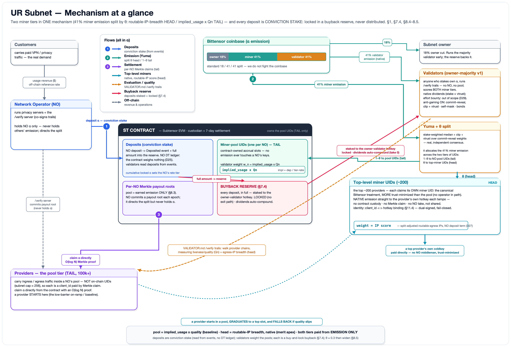
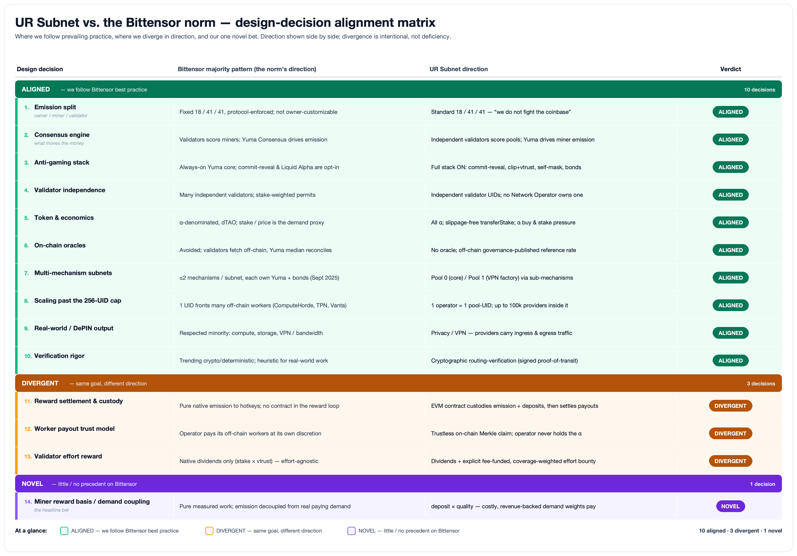

# UR Subnet

**A Bittensor subnet for a decentralized privacy network.**

This repository (`sn`) is the reference implementation of the UR Subnet — the smart
contract, the off‑chain operator/validator software, and the chain configuration that
run a decentralized privacy/VPN network entirely through on‑chain incentives.

**Network Operators** run the servers. Independent **providers** carry ingress/egress
traffic. Independent **validators** run the [`VALIDATOR.md`](VALIDATOR.md)
routing‑verification protocol — walking server‑assigned chains of providers to prove
real‑time transit and measure *which providers are the weakest links*. Bittensor's
**Yuma Consensus** turns that measurement into emission. Everything is denominated in the
subnet's native token — **α**, branded **$UR**.

The full specification is in [`WHITEPAPER.md`](WHITEPAPER.md); the design rationale versus
the rest of the Bittensor field is in [`COMPARISON.md`](COMPARISON.md).

---

## Mechanism at a glance

Money flows in three coupled channels, all in α:

1. **Deposits — the demand signal, conviction stake, and a buyback.** Each NO deposits α
   into the ST contract, sized to its real usage at an **off‑chain published rate**
   (no on‑chain oracle). Deposits are the costly signal of real demand — and they are
   **never distributed**: the contract moves every deposit into a locked **buyback
   reserve** (α staked to the owner's validator hotkey, compounding dividends, with no
   code path out). A NO's cumulative locked α (its **conviction**) sets its **tier → rate**:
   zero conviction pays the baseline rate; more conviction lowers it — the onboarding and
   alignment lever.

2. **Emission (Yuma Consensus).** The Bittensor coinbase pays the standard
   **18% owner / 41% miner / 41% validator** α split. Each tempo (~72 min), independent
   validators score **both miner tiers** from their own trails, submit weights under
   **commit‑reveal**, and Yuma's stake‑weighted **median + clipping + vtrust** turns those
   scores into miner emission — so the validators' evaluation *is* what moves the money.
   Validator emission flows **natively** (∝ stake × vtrust).

3. **Settlement (7‑day epoch).** Over each epoch the contract accrues the captured miner
   emission and providers **claim their α directly from the contract** with cryptographic
   proofs. A NO *directs* where its pool's rewards go but **never holds anyone else's funds**.

### Two miner tiers, in parallel

Because one NO may serve **100k+ providers — far beyond a subnet's ~256 UID cap** — the
miner side runs two tiers inside **one** mechanism, divided by a governance share **θ**:

- **Pool tier (tail, `1−θ`)** — the **on‑ramp**. Each NO is a single contract‑owned
  **pool UID**; validators weight it `implied_usage × quality` (implied usage = the NO's
  deposit ÷ its tier rate). Its providers are *not* UIDs — they are paid *inside* the pool
  by **Merkle claim**. Low barrier (join a NO, no UID, no registration burn), baseline reward.
- **Top‑level miners (head, `θ`)** — the **supply apex**. The **top ~200 fleets by
  split‑adjusted distinct routable egress‑IP count** (real VPN supply breadth, *not*
  traffic volume) each claim their **own miner UID**, are steered **directly** by
  validators, and are paid **natively** to their own hotkey — no contract custody, no
  Merkle claim, no operator in the payout path. A fleet is matched to its UID by a
  **dual‑signed `client_id`s ⇄ hotkey binding**.

A provider **starts in a pool, graduates to a top slot** as its routable‑IP breadth grows,
and **falls back** if it slips — with Bittensor's native deregistration churn running that
tournament. A `client_id` earns in **exactly one** tier at a time (no double‑pay). Start
tail‑weighted (**θ ≈ 0.3**) and widen it as the top‑miner set and validator consensus mature.

### Custody and trust model

- **No‑custody in spirit.** The owner and NOs never hold or distribute anyone else's α.
  The contract is the sole custodian of in‑transit α; every pool payout is a **direct
  on‑chain pull claim**; the head is paid **natively**.
- **Finalized claims are sacrosanct** from day one — no upgrade, pause, or admin action can
  block or claw back a finalized claim.
- **The buyback reserve is one‑way** — no contract function ever sources a transfer out of it.
- **Progressive decentralization.** Launch is centralized‑but‑bounded (owner multisig behind
  an upgradeable contract), hardening to a **timelock + pause‑only guardian**, then broader
  governance and eventual immutabilization of the custody/settlement core.

---

## How this compares to the Bittensor field

The UR Subnet follows the Bittensor core almost everywhere and diverges only deliberately.
Of the major design decisions, **12 are aligned** with prevailing practice, **2 are
divergent** (reward settlement/custody and the worker‑payout trust model — both *toward*
trustlessness), and **2 are genuinely novel bets**: coupling miner reward to real,
revenue‑backed demand (`implied_usage × quality`) and tiering miners into a trust‑minimized
pooled tail plus a directly‑paid head.

Full analysis, per‑theme and per‑subnet, is in [`COMPARISON.md`](COMPARISON.md).

---

## Participate

### Register a network operator

Register a network‑operator key, then run the `/verify` server and deposit α. See the
provider/operator documentation at <https://ur.xyz>. Operators register a `client_id` with
the subnet used for root contracts, so they can independently audit their contracts. In the
launch phase, operator admission is owner‑gated.

Each epoch, an NO commits the Merkle **payout root** that splits its pool among its
providers. It directs the split; the contract holds and pays.

### Register a provider (ingress or egress)

Follow the provider documentation at <https://ur.xyz>. Providers work with network
operators — the default list of operators in the code is a good place to start, and you can
add more with `-no <domain>` (repeatable) or `-nofile <path>` (one operator domain per line).

Providers register a `client_id` with the subnet, and are paid *inside* their NO's pool by
**Merkle claim** against that NO's payout root. A provider whose **routable‑IP breadth**
ranks among the network's **top ~200 fleets** can claim its own **top‑level miner UID** and
be paid **directly** by validator emission steering — no pool, no operator in the payout
path. It links its `client_id`s to its wallet/hotkey with a **dual‑signed binding** so
validators can attribute its measured breadth to that slot. See
[`WHITEPAPER.md`](WHITEPAPER.md) §8.4 and §11.4.

### Register a validator

Validators stake their **own** α, run the [`VALIDATOR.md`](VALIDATOR.md)
routing‑verification protocol (walking provider chains to measure quality and routable‑IP
breadth), and each tempo score **both** miner tiers under commit‑reveal — the pools by
`implied_usage × quality` and the head by routable‑IP breadth. Validators earn
Bittensor‑native **dividends** (∝ stake × scoring accuracy) — v1's only validator reward.
No NO owns a validator; the set is permissionless and Bittensor‑native.

The epoch lifecycle (a *block* is the 7‑day settlement epoch, ≈ 50 400 chain blocks):

| When | What |
|---|---|
| `t = 0` | Epoch closes. The contract snapshots per‑NO deposits and pool emissions. |
| `t ≤ +4h` | Each NO commits its payout‑list root for the epoch. |
| `t < +48h` | Audit window — committed roots are public; a bad head binding is disputable on‑chain. |
| `+48h` | `finalizeEpoch`: pool totals (emission only) are snapshotted and **claims open**. |

Top‑level miners need **no settlement** — Yuma pays their UID natively each tempo.

---

## Pool 0 / Pool 1

The subnet uses Bittensor's **sub‑mechanism** feature for the product‑line split:

- **Mining Pool 0 / Validator Pool 0** — *the core network* (mechanism 0). Fully specified
  by [`WHITEPAPER.md`](WHITEPAPER.md); v1 launches this.
- **Mining Pool 1 / Validator Pool 1** — *the VPN factory* (mechanism 1). Same contract,
  same α, same role types, its own per‑mechanism accounting, with the owner setting the α
  split between pools. See <https://vpn.dev>.

The two *miner tiers* (pool on‑ramp + top‑level miners) live **within one mechanism**,
divided by the weight‑level share θ — not by the mechanism split. Mechanisms are reserved
for the product‑line split, because a second mechanism would halve the 256‑UID space below
the ~200 top miners.

---

## Repository layout

| Path | What |
|---|---|
| [`WHITEPAPER.md`](WHITEPAPER.md) | The full subnet specification. |
| [`VALIDATOR.md`](VALIDATOR.md) | The off‑chain routing‑verification (`/verify`) protocol. |
| [`COMPARISON.md`](COMPARISON.md) | Design‑decision comparison versus the Bittensor field. |
| [`diagrams/`](diagrams/) | The diagrams above (SVG sources + generators). |
| `evm/` | The ST contract (Solidity, Subtensor EVM) and its ABI. |
| `validator/` | The validator binary. |
| `miner/`, `cli/`, `stctl/` | Miner/operator tooling and the subnet control CLI. |
| `crv4/`, `merkle/`, `ss58/`, `stabi/` | Supporting libraries (commit‑reveal v4, Merkle trees, address encoding, contract bindings). |
