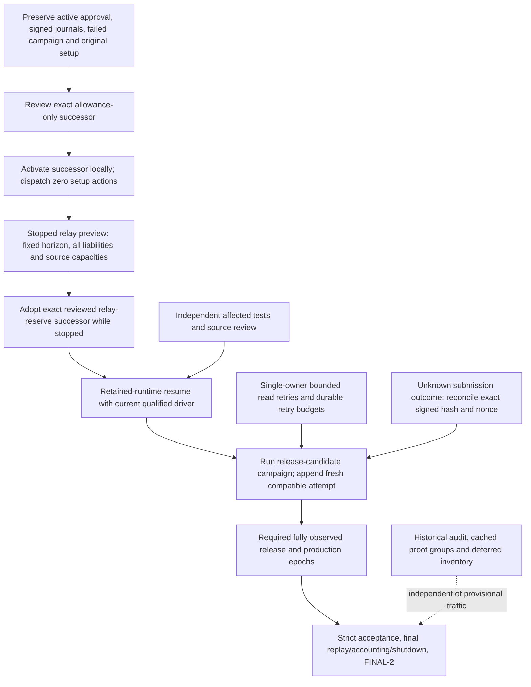

# Continuation dependency and invariant review — 2026-09-21

This review covers the path from the retained failed campaign to a new real
release/production run. It separates source findings, authored corrections,
and remaining live obligations. It does not establish final acceptance.
The controlling instructions are the opening of `sn/FINALIZE.md` and
`sim-testnet/README.md` sections “Incremental recovery and acceptance” and
“Continuation decision before a manual stop”. New RPC work uses the approved
owned LAN node without application pacing or public fallback.

## Actual stopping condition

The invocation retained at
`/mnt/data/sn-testnet/qualification/allowance-adoption-512-20260921T230312Z/`
authenticated 8,633 local receipts, then refused a still-pending
`precompile.probe-deploy` in `provisional-revision-setup-prefix`. Doctor also
refused the changed Connect checkout's release lock. There was no new chain
transaction or observed RPC timeout in this refusal. The cap-only plan had
preserved the old pending action; it had not asked to execute it.

The source-level cause spans four gates:

1. Provisional setup assumed every successor needed its entire setup prefix.
2. It required a live supervisor even though relay continuation capture requires
   the supervisor and validators stopped.
3. Ordinary stopped `resume` reopened the prefix through
   `executeSetupActions(..., "config.render")` and the whole-plan doctor.
4. `LaunchDeployment` additionally provisioned accounts, executed the remaining
   setup actions and rendered configuration. Bypassing only gate 3 would still
   have repeated setup.

The candidate addresses these as one local approval/process-recovery boundary.
The exact shared allowance or relay-reserve transformation, archived approval,
current invocation provenance, original release identity, unchanged custody,
full local receipt census and topology receipt remain authenticated. Ordinary
repairs retain their existing action reconciliation path. Strict commands retain
their release, receipt and acceptance requirements.

## Ranked dependency graph



| Priority | Dependency / present evidence | Concrete completion condition |
| --- | --- | --- |
| P0 | Cap adoption still meets a pending-probe/strict-release gate | Qualify and integrate the exact local-only adoption route; active successor equals its archived review; journal and pending actions unchanged |
| P0 | Relay capture and old live-only adoption form a stop/start cycle | Keep supervisor and validators stopped; capture and adopt the exact continuation under the separately approved caps; never restart the old 1,024-slot plan just to satisfy a live guard |
| P0 | Ordinary resume would repeat setup even after adoption | Use the qualified retained-runtime branch: authentic static runtime files, qualified driver, explicit current API/handoff approval, zero setup/tournament dispatch |
| P1 | Relay preview candidate `9aa93ae4` had two fixture refusals, corrected by `6a067e22` | Retain the initial failures; qualify the exact owned-route and historical source-release fixture correction without weakening production guards |
| P1 | Retry/checkpoint candidates preserve bounded attempts, with oracle-local capacity correction | Preserve the original retry deadline/attempt, one retry owner and one bounded write attempt; use the qualified oracle correction so unrelated learned batch capacity cannot alter its complete groups |
| P1 | Fresh relay horizon, keeper balance and transaction exposure are moving facts | Pin the actual new capture; preserve every original liability and signed request; reconcile finalized nonce/balance before any separately bounded funding |
| P1 | Failed/interrupted acceptance intervals are immutable history | Append a fresh attempt under the current approved plan; reuse only authenticated unchanged preparation; start a new future fully observed acceptance interval |
| P2 | Historical audit remains unresolved | Retry only missing proof groups; preserve successful receipts and deferred per-action errors; strict final acceptance refuses every unresolved deferral |
| P2 | Final peer-review closure | Record actual 360/60/180/6 cadence and three observed production epochs, real validator limit, final reserve measurement, RootMissed carry and settlement chain, and signer/commit authorization; distinguish artifact-only claims and owned-node provenance |

## Invariants through each transition

| Boundary | What may change | What stays exact / failure behavior |
| --- | --- | --- |
| Approval checkpoint | Active pointer advances to an archived, reviewed descendant | Original plan/config/policy, source bytes, failed evidence and journal are never rewritten or marked successful |
| Cap revision | Only approved total-TAO/EVM ceilings and their deterministic identity fields | Every action/intent/spend and original funding allocation remains unchanged; raising a cap cannot fund the whole cap |
| Relay continuation | Shared `appendEvidenceRelayContinuationPlan` reserve/slot/fee transformation and its bounded campaign-reserve adjustment | Source approval, journal prefix, exact request bytes, old higher-fee liabilities, stopped source ledgers, fixed horizon and native/EVM pins remain committed; no funding transaction is added |
| Provisional setup adoption | Local active-plan pointer plus explicit non-accepting provenance | Pending probe/config/setup work stays pending and is listed as deferred; no chain reader, signer, new nonce or action dispatcher is opened |
| Stopped process handoff | New qualified executable and explicit successor API/validator handoff ownership | Original runtime configs, accounts, namespaces, child identity/arguments, retained manifest bytes and journal remain retained; recheck stopped generation immediately before publishing |
| Startup partial failure | Retry the process owner or recover an unstarted manifest publication | Recover only the exact old stopped state, inactive service and no supervisor owner; never restore over a new/live generation; preserve original/successor manifests and provenance |
| Runtime version change | Fresh current operations use the reviewed compatibility adapter; pinned historical reads use their original runtime identity | A historical runtime observation cannot authorize signing/current dispatch. Do not rewrite original signed config/metadata merely to match today's runtime number |
| Read timeout | One bounded owner retries the exact route/block/target/calldata; adaptive split retains authenticated successful elements | Cancellation, exhausted budgets, hard identity/decode errors remain visible; no outer loop resets an exhausted audit or retry deadline |
| Unknown write outcome | Reopen exact signed raw bytes/hash/nonce and original recovery checkpoint | Timeout is not proof of non-execution. Receipt/nonce reconciliation precedes any rebroadcast; never generate a fresh transaction to resolve uncertainty |
| Consumed retained nonce | A matching prior broadcast plus exact finalized coordinates for the same signer in approved lineage can establish slot consumption | This permits only retained provisional process startup. It neither proves an old action's effects nor creates a verified receipt, refunds spend, replays an action, or grants final acceptance. Native signer case and EVM/native nonce domains stay distinct |
| Provisional campaign | Append fresh compatible recovery attempt, run traffic while historical audit proceeds | Actual approved plan/config is current; failed ancestor signatures and signed boundaries stay original; no inherited acceptance or fabricated progress |
| Final acceptance | Compose unchanged qualifying evidence with newly observed required scopes | `final_acceptance=false`, unresolved historical deferrals, invalidated intervals or missing observations cannot satisfy the strict final gate |

## Retry and checkpoint analysis from the parallel lane

The separate analysis is retained at
`/home/by/urnetwork/temp/astra-rpc-checkpoint-20260921/RETRY-CHECKPOINT-ANALYSIS.md`.
Its concrete corrections cover reset retry attempts/deadlines on reopen, crash
before terminal sealing, multiplied nested native retries, late nil after an
attempt deadline, mixed integrity/timeout classification and an unbounded owned
HTTP submission. EVM and native senders already persist original signed bytes
and StageBroadcast before transmission. Their unknown-outcome recovery must
remain exact; a generic whole-action retry would be unsafe.

Remaining source risks there are explicit follow-ups, not proven live blockers:
contextless legacy native read helpers, substring matching of known-transaction
messages, and a native subscription error channel without a closed-channel
check. Do not hold the provisional run for an unobserved broad rewrite; add
focused controls when touching those owners.

## Operational sequence after qualification

These are reviewed command forms, not a claim that they have executed. Resolve
all placeholders to the retained current state, approved configuration, owned
RPC authority and exact archived hashes; preserve every command's output.

1. `plan --allowance-only --plan-hash <active>` reviews the cap increase without
   changing current action/funding authority. `setup --provisional-resume
   --apply --plan-hash <reviewed-cap>` activates only that exact successor.
2. If already stopped, keep it stopped. Use the qualified `relay-continuation
   --provisional-capture --plan-hash <active-cap> --relay-end-block <fixed>
   --relay-slots 2048` against the owned RPC. Retain the actual-reader provenance
   and reviewed archived successor. No old-plan restart or imported guessed
   horizon belongs between capture and adoption.
3. `setup --provisional-resume --apply --plan-hash <reviewed-relay>` uses the
   stopped local-only adoption path. It must report `plan_only=true`,
   `final_acceptance=false`, and no action dispatch. Verify exact active bytes,
   journal terminal hash, original setup hashes and unchanged pending statuses.
4. `resume --provisional-resume --apply --plan-hash <active-relay>` selects the
   retained-runtime branch, starts the successor topology and reports
   `setup_actions_dispatched=0`. It does not itself start or pass the campaign.
   If startup is recoverably partial, preserve the owned generation and resume
   it; do not replay setup or capture a different horizon without a new review.
5. `scenario --name release-candidate --provisional-resume --apply --plan-hash
   <active-relay>` runs the actual campaign. Historical `audit --plan-hash
   <active-relay>` runs independently against the same retained state and owned
   RPC, using immutable journal snapshots/proof checkpoints.

A provisional successful run still needs the strict final acceptance work in
the graph. No honest completion ETA can omit the actual required observed
interval or pretend a failed interval can continue in place.

## Qualification and retained-journal accounting

The base startup implementation is `bb4cc77feffff4f3a4574618e09dd6372f9278fb`
on `astra/provisional-allowance-adoption-20260921`. Its final adjacent selector
contains 14 roots. The 13-root normal run passed in 37.919 seconds, the added
unknown-transaction guard and stopped-start pair passed in 7.198 seconds, and
the final 14-root race run passed in 274.600 seconds. The final 12-file source
manifest remained byte-identical before and after the race; its SHA-256 is
`5d42422d0223d3dab7e01037f4db30164dbd36a992122fbe4d3a71e153933283`.
Raw commands, exit receipts and source fences are under
`/mnt/data/sn-testnet/qualification/terra-successor-startup-20260921/`.

The subsequent narrow correction
`bc9b89b4aa060d4b7ebf2357e92f8781c0d8b6ee` distinguishes exact transaction
history from action identity: an earlier verification cannot resolve a later
different broadcast. A hashless historical receipt is reusable only when its
preceding transaction identity is unique. Duplicate hashes must retain their
signer and nonce. Finalized coordinates bind to a preceding exact broadcast;
only a sufficient finalized nonce for the same signer can establish that a
remaining old slot is already consumed. Four additional deterministic roots
cover these distinctions, malformed evidence, and unchanged original entries.
The following six-root selector passed normally in 6.722 seconds and with race
detection in 53.594 seconds; census and pre/post source fences bind the executed
candidate to `bc9b89b4`. It was integrated by the coordinating agent as
`b3af1b08` without changing the isolated candidate.

```sh
./scripts/with-test-storage.sh go test ./sim-testnet \
  -run '^(TestProvisionalPlanAdoptionRetainedStartup.*|TestProvisionalPlanAdoptionStoppedGeneration)$' \
  -count=1 -parallel=4 -timeout=10m
./scripts/with-test-storage.sh go test -race ./sim-testnet \
  -run '^(TestProvisionalPlanAdoptionRetainedStartup.*|TestProvisionalPlanAdoptionStoppedGeneration)$' \
  -count=1 -parallel=4 -timeout=10m
```

The correction's retained evidence is under
`/mnt/data/sn-testnet/qualification/terra-provisional-allowance-adoption-20260922/`:
`candidate-census.log`, `candidate-normal.log`, `candidate-race.log`,
`candidate-source-fence.log` and `candidate-post-run-source-fence.log`.
The superseded `e1206779` attempt was interrupted before final candidate
qualification and is explicitly excluded. Base startup qualification and this
later correction are separate scopes; neither substitutes for a live campaign
or strict final acceptance.

A read-only source-analysis census at 2026-09-22 00:24 UTC inspected the actual
retained 45,465-entry journal without changing it. Among 8,817 exact broadcasts,
8,802 had exact local outcomes and 15 additional slots had same-signer finalized
nonce progress; zero remained unresolved under the corrected startup rule.
This is local journal analysis, not independent on-chain verification or a
compiled candidate test. The original 12-row census grew to 15 after the exact
ordering/ambiguity rule exposed three additional old broadcast identities;
all three also had consumed slots. Those action effects remain historical
audit work. Restricted raw census artifacts are retained outside the repository:

- `/mnt/data/sn-testnet/qualification/provisional-allowance-adoption-20260921/retained-nonce-census.json`
- `/mnt/data/sn-testnet/qualification/provisional-allowance-adoption-20260921/retained-nonce-candidate-analysis.json`

The census bound plan bytes to SHA-256
`7023a9592652c5f7a20bb8f1c5fb5a964a0073d40f81e2c92b0ca9374d08295f`
and journal bytes to
`e7c2bed59f8cd7bf1de44c9e4f0202eb61754d1415d034de7310d3bc5bebe293`.
Recheck the current retained state before an operational transition; these are
pinned observations, not permission to substitute a later journal or plan.
