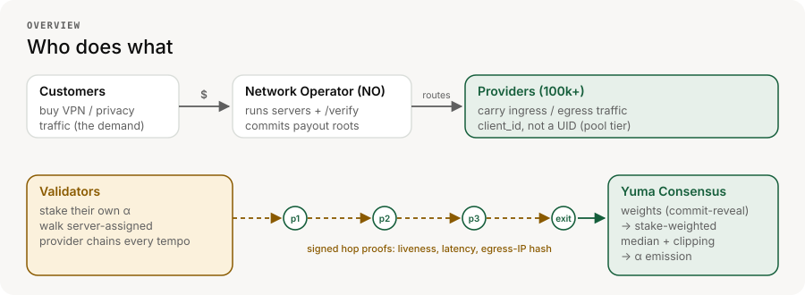
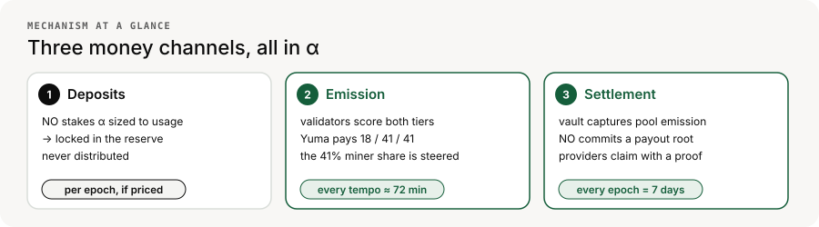
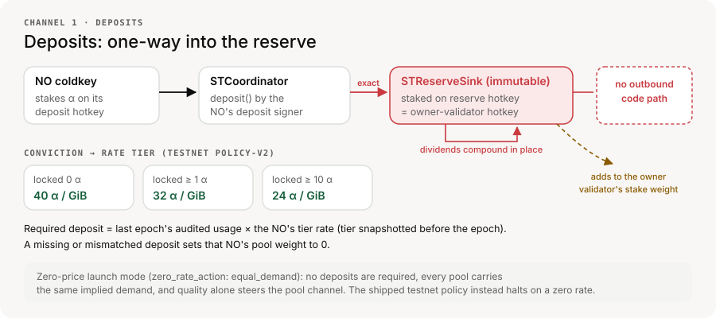
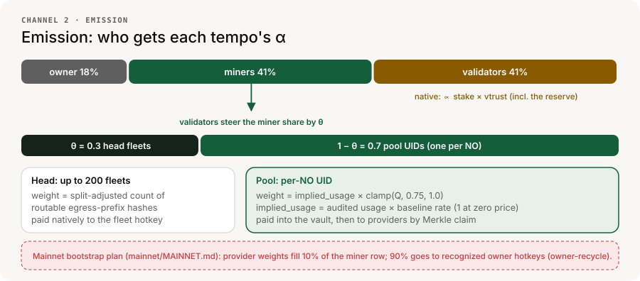
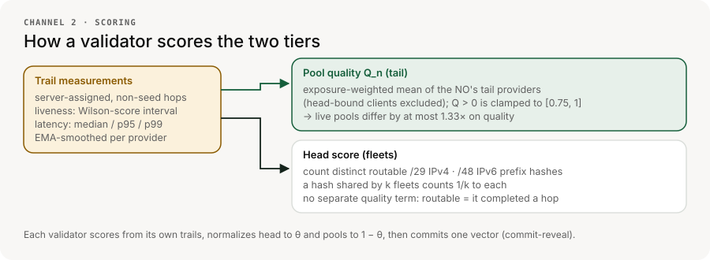
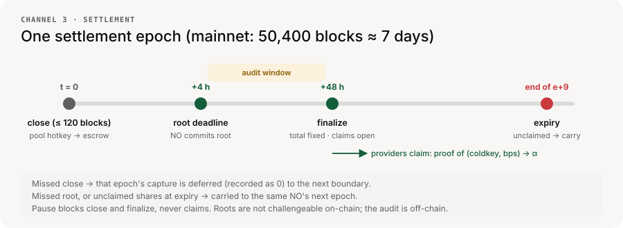
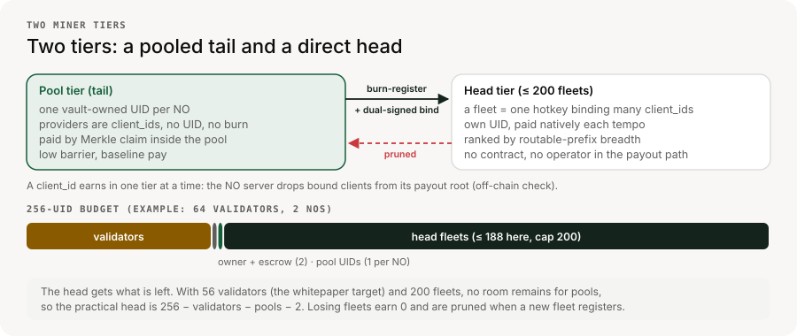
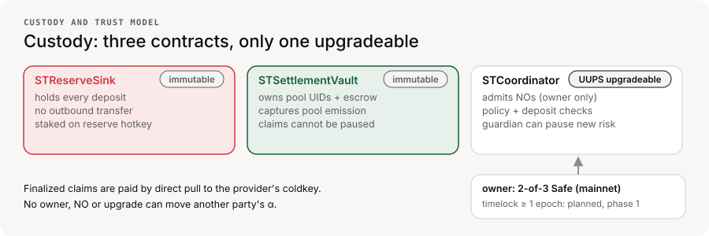
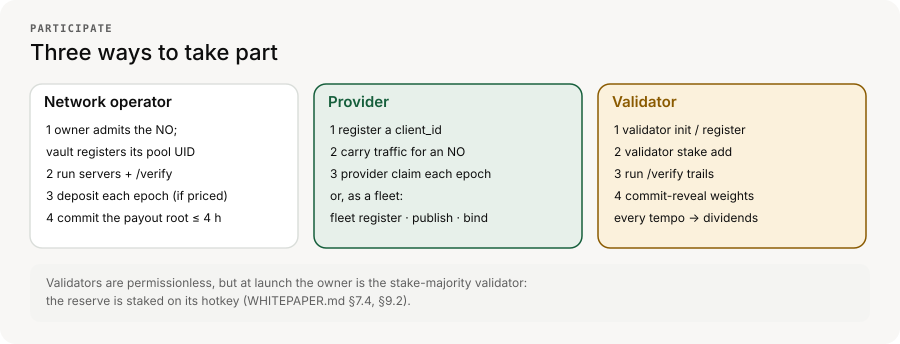
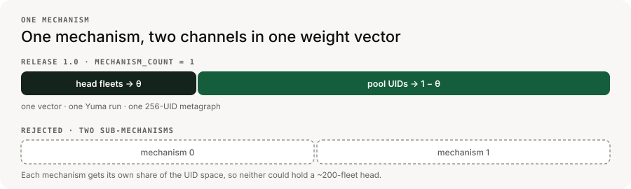

# UR Subnet

**Bittensor SN25 (netuid 25): a subnet for a decentralized privacy network.**

This repository (`sn`) is the reference implementation of the UR Subnet — the EVM
contract suite, miner and validator software, chain tooling, and the real-testnet
integration harness. The operator/API implementation lives in the sibling `server`
repository, which also runs provider egress probing (reachability, location,
bandwidth and egress health) as recurring taskworker tasks.

**Network Operators (NOs)** run the privacy servers and sell the traffic. Independent
**providers** carry ingress/egress traffic for them. Independent **validators** run the
[`VALIDATOR.md`](VALIDATOR.md) routing‑verification protocol — walking server‑assigned
chains of providers to prove real‑time transit and measure *which providers are the weakest
links*. Bittensor's **Yuma Consensus** turns that measurement into emission. Everything is
denominated in the subnet's native token — **α**, branded **$UR**.

The full specification is in [`WHITEPAPER.md`](WHITEPAPER.md); the design rationale versus
the rest of the Bittensor field is in [`COMPARISON.md`](COMPARISON.md). Terms are defined in
the [glossary](#glossary) at the end.

---

## Mechanism at a glance

Money flows in three coupled channels, all in α. The detailed map of every contract and
flow is [`diagrams/mechanism.png`](diagrams/mechanism.png).

### 1. Deposits — the demand signal, conviction stake, and a buyback

Each NO deposits α sized to its real usage, taken from its signed payout artifact for the
**previous** epoch, at an **off‑chain published rate** (no on‑chain oracle). The NO stakes
the α on its own deposit hotkey; its deposit signer then calls `deposit` on `STCoordinator`,
which moves the exact amount into the immutable `STReserveSink`, staked on the fixed reserve
hotkey. The reserve hotkey is the **owner‑validator hotkey**, set at initialize
([`WHITEPAPER.md`](WHITEPAPER.md) §15.2). The sink has **no outbound code path**, so deposits
are **never distributed**: their dividends compound in place, and their stake adds to the owner
validator's consensus weight.

A NO's cumulative locked α (its **conviction**) sets its **tier**, and the tier sets its
**rate**: zero conviction pays the baseline rate, and more conviction lowers it. The tier is
snapshotted before each epoch. A missing or mismatched deposit sets that NO's pool weight to 0.
Deposits are the costly signal of real demand, and the NO is expected to fund them by buying α
on the market from revenue (the buyback, §7.4). That purchase is off‑chain and not enforced.

**Policy modes.** The signed policy chooses how usage is priced (`rao_per_gib` today; per‑user
pricing is a schema option) and what a zero rate means. With
`zero_rate_action: equal_demand`, no deposits are required or audited and every pool carries
the same implied demand, so measured quality alone steers the pool channel. The shipped
testnet policy ([`deploy/testnet/policy-v2.yml`](deploy/testnet/policy-v2.yml)) is bytes‑only
and halts on a zero rate.

### 2. Emission — Yuma Consensus

The Bittensor coinbase pays the standard **18% owner / 41% miner / 41% validator** α split.
Each tempo (360 blocks, ~72 min), validators score **both miner tiers** from their own trails,
submit one weight vector under **commit‑reveal**, and Yuma's stake‑weighted
**median + clipping + vtrust** turns those scores into miner emission — so the validators'
evaluation *is* what moves the money. Validator emission flows **natively** (∝ stake × vtrust),
including to the stake the reserve holds.

The validators' vector splits the miner share by a governance parameter **θ** (start θ = 0.3):

- **Head (θ):** each top‑level fleet is weighted by its split‑adjusted count of distinct
  routable egress‑prefix hashes.
- **Pool tail (1 − θ):** each NO's pool UID is weighted `implied_usage × clamp(Q_n, 0.75, 1.0)`,
  where `implied_usage` is the NO's audited usage priced at the baseline rate (exactly 1 for
  every pool at zero price) and a pool with `Q_n = 0` gets 0.

Because the quality clamp is [0.75, 1.0], live pools differ by at most 1.33× on quality. Under
zero‑price launch mode demand is equal, so the pool share is close to an even split across
pools until pricing is switched on.

θ only takes effect if a stake‑majority of validators runs the same θ, so it is a published
governance value, not per‑validator discretion. If no head fleet exists, the θ share cedes to
the pools (`empty_channel: cede_to_nonempty`).

> **Mainnet bootstrap plan.** [`mainnet/MAINNET.md`](mainnet/MAINNET.md) records a launch in
> which provider weights fill **10%** of the native miner allocation and the other **90%** is
> weighted to recognized owner hotkeys (`owner-recycle`), with existing SN25 miner
> registrations reset. Read the emission figures above as the steady‑state design.

#### How validators score

Validators measure every provider on **server‑assigned, non‑seed** hops: a **Wilson‑score**
liveness interval and latency percentiles (median / p95 / p99), EMA‑smoothed per provider
([`VALIDATOR.md`](VALIDATOR.md) §11.1). A pool's `Q_n` is the exposure‑weighted mean of its
tail providers, excluding any client bound into a head fleet. A fleet's head score counts the
distinct routable /29 IPv4 or /48 IPv6 prefix hashes its clients served; a hash shared by k
fleets counts 1/k to each. Routable means a real trail hop completed through it, so the head
needs no separate quality term.

### 3. Settlement — the 7‑day epoch

Pool emission accrues on each NO's vault‑owned pool hotkey. At the epoch boundary anyone
closes the epoch and the vault moves that emission to its escrow hotkey. The NO **directs** the
split by committing a Merkle **payout root**, and providers **claim their α directly from the
vault** with a Merkle proof. A NO never holds anyone else's funds. The full timeline is under
[epoch lifecycle](#epoch-lifecycle).

### Two miner tiers, in parallel

One NO may serve **100k+ providers, far beyond a subnet's 256‑UID cap**, so the miner side
runs two tiers inside **one** mechanism, divided by **θ**:

- **Pool tier (tail, `1−θ`)** — the **on‑ramp**. Each NO is a single vault‑owned
  **pool UID**, weighted as above. Its providers are *not* UIDs: they are paid *inside* the
  pool by **Merkle claim**. Low provider barrier (join a NO; no UID or burn needed, because the
  immutable vault owns one shared, burn‑registered pool UID per NO), baseline reward.
- **Head (top‑level miners, `θ`)** — the **supply apex**. Up to **200 fleets**
  (`maximum_head_fleets`) by split‑adjusted routable‑IP breadth (real VPN supply breadth, *not*
  traffic volume). A **fleet** is one hotkey binding many `client_id`s through a
  **dual‑signed `client_id`s ⇄ hotkey binding**. Each fleet claims its **own miner UID**, is
  steered **directly** by validators, and is paid **natively** to its own hotkey — no contract
  custody, no Merkle claim, no operator in the payout path.

**Promotion and demotion.** A fleet promotes itself: it burn‑registers a UID, publishes its
manifest commitment and binds its clients. Each validator ranks bound fleets by its own
measured score and weights at most 200; the rest get 0. There is no native "top‑N keeps the
slot" rule: the chain deregisters the **lowest‑emission** UID when a new registration arrives
on a full subnet, and that is the tournament. A demoted fleet's clients fall back to earning
in their NO's pool. A single residential provider scores about 1 prefix, so the head is in
practice for operators of many routable IPs.

A `client_id` earns in **exactly one** tier at a time: the NO's server drops bound clients from
its payout root. The vault cannot check this itself (its leaves are `(coldkey, share bps)`), so
the guarantee is off‑chain and audited through the public payout artifacts.

**Sizing θ.** Start tail‑weighted (**θ ≈ 0.3**) and widen it as the top‑miner set and
validator consensus mature. Hard constraint: the lowest‑paid top miner must earn at least the
highest‑paid pool provider, or graduating is a pay cut (§8.5).

**UID budget.** All of this shares 256 UIDs:
`head fleets + one pool UID per NO + validator UIDs + owner and escrow identities ≤ 256`
(§14). The head gets what is left; for example 64 validators, 2 NOs and 2 owner/escrow UIDs
leave 188 head slots.

### Custody and trust model

- **No operator custody.** The owner and NOs never hold or distribute anyone else's α.
  The immutable vault is the sole custodian of in‑transit pool emission; every payout is a
  **direct on‑chain pull claim** paid as α stake to the claimant's coldkey; the head is paid
  **natively**.
- **Finalized claims are sacrosanct** from day one — no upgrade, pause, or admin action can
  block or claw back a finalized claim. Pause stops new close/finalize calls, never claims.
- **The buyback reserve is one‑way** — no contract function ever sources a transfer out of it.
- **Split governance.** `STReserveSink` and `STSettlementVault` are non‑upgradeable from
  launch. Only `STCoordinator` is UUPS‑upgradeable: testnet uses a dedicated value‑capped
  owner, and mainnet uses a distinct Safe, 1‑of‑1 at the SN25 launch (a Safe transaction can
  add owners and raise the threshold later). A ≥1‑epoch upgrade timelock is planned
  for Phase 1 (§6.4.2, §16.3 M5); the current coordinator has none.

---

## How this compares to the Bittensor field

The UR Subnet follows the Bittensor core almost everywhere and diverges only deliberately.
Of the major design decisions, **12 are aligned** with prevailing practice, **2 are
divergent** (reward settlement/custody and the worker‑payout trust model — both *toward*
trustlessness), and **2 are genuinely novel bets**: coupling miner reward to real,
revenue‑backed demand (`implied_usage × quality`, inactive while the published price is
zero) and tiering miners into a trust‑minimized pooled tail plus a directly‑paid head.

Full analysis, per‑theme and per‑subnet, is in [`COMPARISON.md`](COMPARISON.md).

---

## Participate

### Register a network operator

In the launch phase, operator admission is **owner‑gated**: the owner calls
`registerOperator` on `STCoordinator` with the NO's coldkey, pool and deposit hotkeys, and its
deposit and root signers, and the vault burn‑registers the NO's pool UID. The NO then runs its
servers and the `/verify` server. See the provider/operator documentation at
<https://ur.xyz>.

Each epoch, a priced NO deposits α (above), and every NO commits the Merkle **payout root**
that splits its pool among its providers. It directs the split; the immutable vault holds and
pays.

### Register a provider (ingress or egress)

Follow the provider documentation at <https://ur.xyz>. Providers work with network
operators — the miner defaults to the reference operator, and you can point it at another
operator with `provider choose_network <api_url> <connect_url>` (`--show` prints the network in
effect, `--reset` returns to the default). `provider provide --all-operators` instead mines
every operator listed at <https://ur.xyz/operators.yml>, one provider per operator (see
[`miner/README.md`](miner/README.md#mining-every-listed-operator)).

Providers register a `client_id` with the subnet, and are paid *inside* their NO's pool by
**Merkle claim** against that NO's payout root (`provider claim`, or `snclaim submit` for an
air‑gapped key). A fleet whose **routable‑IP breadth** ranks among the network's top fleets
can claim its own **top‑level miner UID** and be paid **directly** by validator emission
steering — no pool, no operator in the payout path. The fleet registers that UID itself
(`provider fleet register`: a burned `register_limit` signed by the fleet coldkey, dry run
until `--apply`), publishes its manifest commitment (`provider fleet publish`) and links its
`client_id`s to the hotkey with a **dual‑signed binding** (`provider fleet bind`) so
validators can attribute its measured breadth to that slot. See
[`WHITEPAPER.md`](WHITEPAPER.md) §8.4, §11.4 and §16.1.

### Register a validator

Validators stake their **own** α, run the [`VALIDATOR.md`](VALIDATOR.md)
routing‑verification protocol (walking provider chains to measure quality and routable‑IP
breadth), and each tempo score **both** miner tiers under commit‑reveal — the pools by
`implied_usage × quality` and the head by routable‑IP breadth. Validators earn
Bittensor‑native **dividends** (∝ stake × vtrust) — v1's only validator reward.
No NO owns a validator, and the set is permissionless and Bittensor‑native. At launch the owner
is the stake‑majority validator, because the reserve is staked on its hotkey (§7.4, §9.2).

The `validator` binary carries the whole bootstrap: `validator init` creates the hotkey and
per‑operator client key seeds, `validator register` and `validator stake add` sign
`register_limit` / `add_stake` with a coldkey seed file against the runtime the release
configuration pins (dry runs until `--apply`, every extrinsic journaled), `validator
activate` renders and publishes the `evidence_v2` activation inputs, and `validator status
--config` shows the UID, permit, stake and activation state. Only the coldkey wallet itself
and TAO transfers stay with `btcli`.

### Epoch lifecycle

One settlement **epoch** lasts 7 days (50,400 chain blocks on mainnet; the testnet uses short
accelerated epochs). Offsets below are mainnet values from
[`mainnet/MAINNET.md`](mainnet/MAINNET.md).

| When | What |
|---|---|
| `t = 0` (≤ 120 blocks) | Anyone calls `closeOperatorEpoch`; the vault moves that NO's pool emission to escrow. A missed close defers the capture to the next boundary. |
| `t ≤ +4h` (1,200 blocks) | Each NO commits its payout‑list root for the epoch. A missed root carries the funds to the same NO's next epoch. |
| `t < +48h` | Audit window — committed roots and content‑addressed payout artifacts are public and reproducible. Review is off‑chain; there is no on‑chain challenge. |
| `+48h` (14,400 blocks) | Anyone calls `finalizeOperatorEpoch`: the vault fixes the per‑NO entitlement and **claims open**. |
| end of epoch `e+9` | Claims expire (TTL 8 epochs + 1 grace). Unclaimed shares carry to the same NO. |

Top‑level miners need **no settlement** — Yuma pays their UID natively each tempo.

---

## One mechanism, two scoring channels

Release 1.0 fixes `mechanism_count = 1`. Pool UIDs and direct head UIDs share one native
weight vector; validators normalize the head to `θ` and the pool tail to `1−θ` before
CRv4 commit. A second sub-mechanism is explicitly out of scope because it would partition
the finite UID budget and undermine the intended ~200-member head.

---

## Glossary

| Term | Meaning |
|---|---|
| **NO** | Network Operator: runs privacy servers and `/verify`, owns one pool UID, commits payout roots. |
| **Provider** | A machine carrying ingress or egress traffic, identified by a `client_id`. |
| **Fleet** | One hotkey bound to many `client_id`s; the unit that competes in the head. |
| **Pool UID** | The single vault‑owned miner UID that represents one NO's tail providers. |
| **θ (theta)** | Share of the miner allocation steered to the head; `1−θ` goes to pools. |
| **Q_n** | Pool quality: exposure‑weighted liveness and latency of a NO's tail providers. |
| **implied_usage** | A NO's audited usage priced at the baseline rate; 1 for every pool at zero price. |
| **Conviction** | A NO's cumulative locked deposits; sets its rate tier. |
| **Routable‑IP breadth** | Split‑adjusted count of distinct /29 or /48 egress‑prefix hashes a fleet routed. |
| **Payout root** | Merkle root of `(coldkey, share bps)` leaves splitting one NO's pool for one epoch. |
| **Epoch** | The 7‑day settlement period (50,400 blocks on mainnet). |
| **Tempo** | Bittensor's 360‑block weight and emission cycle, ~72 min. |
| **vtrust** | How closely a validator's weights match the stake‑weighted consensus; scales its dividends. |
| **CRv4** | Bittensor commit‑reveal v4: weights are committed encrypted and revealed later. |

---

## Repository layout

| Path | What |
|---|---|
| [`WHITEPAPER.md`](WHITEPAPER.md) | The full subnet specification. |
| [`VALIDATOR.md`](VALIDATOR.md) | The off‑chain routing‑verification (`/verify`) protocol. |
| [`COMPARISON.md`](COMPARISON.md) | Design‑decision comparison versus the Bittensor field. |
| [`diagrams/`](diagrams/) | The diagrams above (SVG sources + generators; README figures in `diagrams/readme/`, from `readme_figures.py`). |
| `evm/` | Reserve sink, settlement vault, UUPS coordinator, tests, and generated artifacts. |
| `validator/` | The validator binary. |
| `miner/`, `cli/` | Release miner/operator tooling. |
| `stctl/` | Explicitly quarantined pre-1.0 monolith diagnostic; not a release write path. |
| `chain/`, `crv4/`, `merkle/`, `ss58/`, `stabi/` | Supporting libraries (native registration/staking toolkit shared with the harness, commit‑reveal v4, Merkle trees, address encoding, contract bindings). |
| `sim-testnet/` | Spend-capped Go harness for testnet setup, launch, scenarios, evidence, and analysis. |

The release workspace also requires a sibling `server` checkout, which the
testnet harness discovers by Go module identity. The retired `operator-proxy`
repository is no longer discovered, tested or locked. The existing testnet
release lock and harness configs keep its inert fields so their published hashes
stay valid; a fresh release-lock rendering drops them.

SN pins the client-authentication SDK, Connect, and Connect's SCTP fork with
versioned replacements in `go.mod`; these dependencies do not follow sibling
checkout HEADs. Use `GOWORK=off` for this module graph. The remaining local
replacements still require the release workspace. See the
[source-graph correction and qualification handoff](mainnet/evidence/clientauth-source-graph-correction-20260929.md)
for exact revisions and the independent module-resolution regression tests.
The [incremental composition record](mainnet/evidence/incremental-source-composition-20260929.md)
retains the completed SDK/MG06 checks and explicitly pending broad SDK race run.
